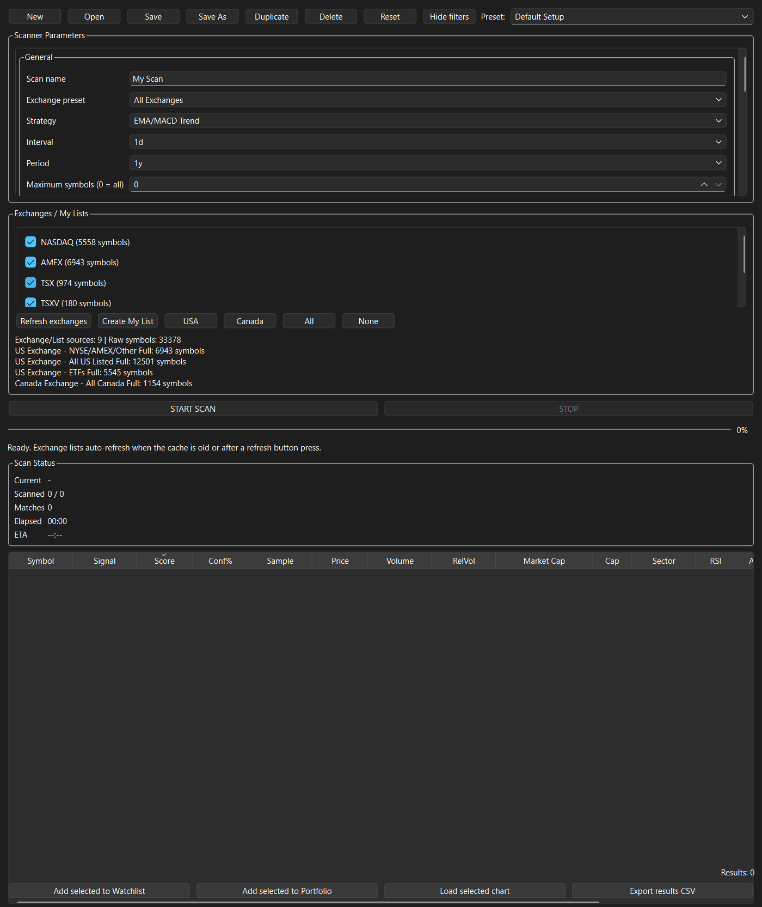
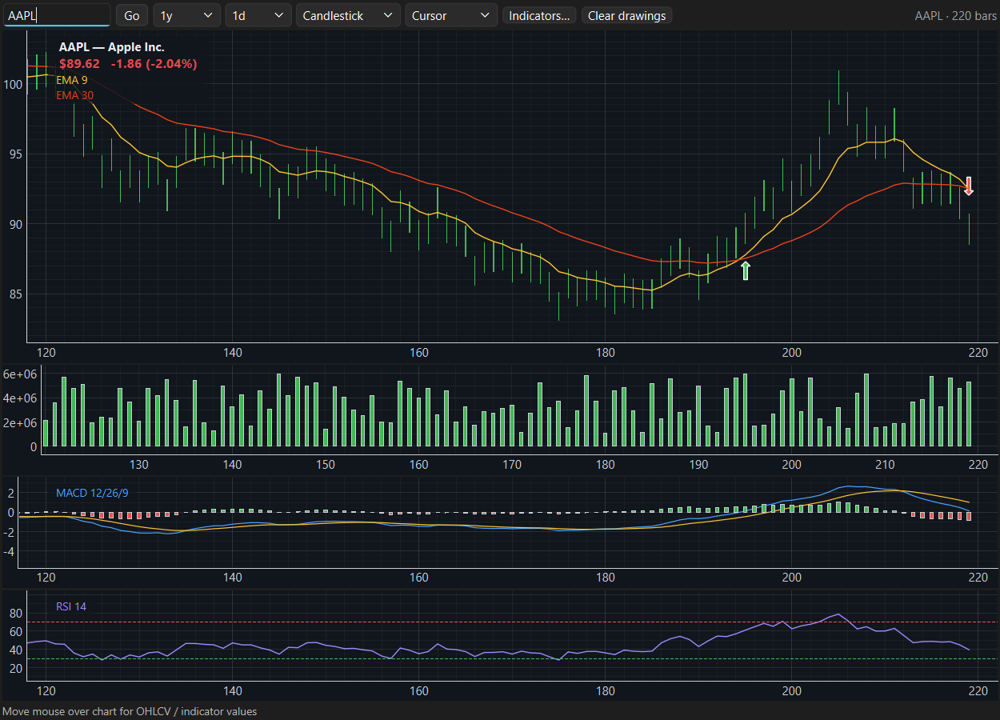
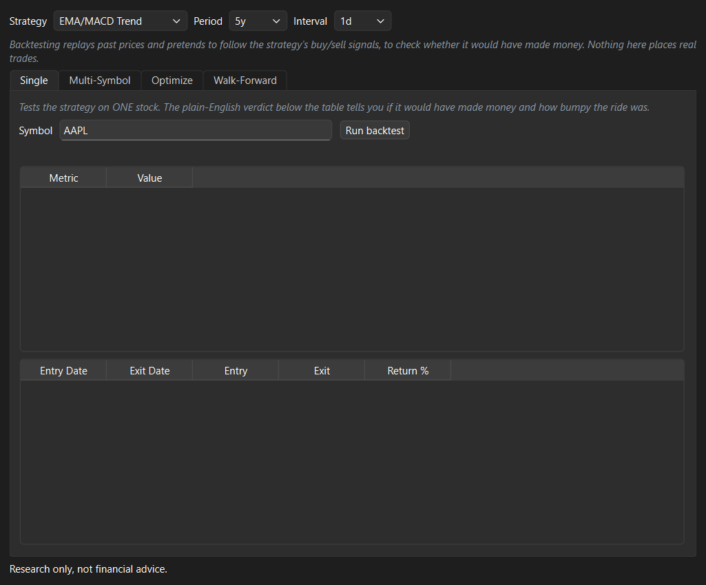
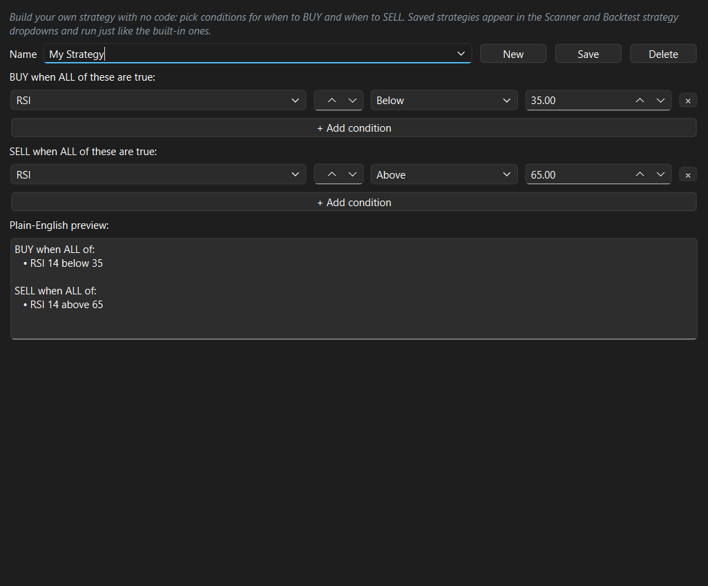
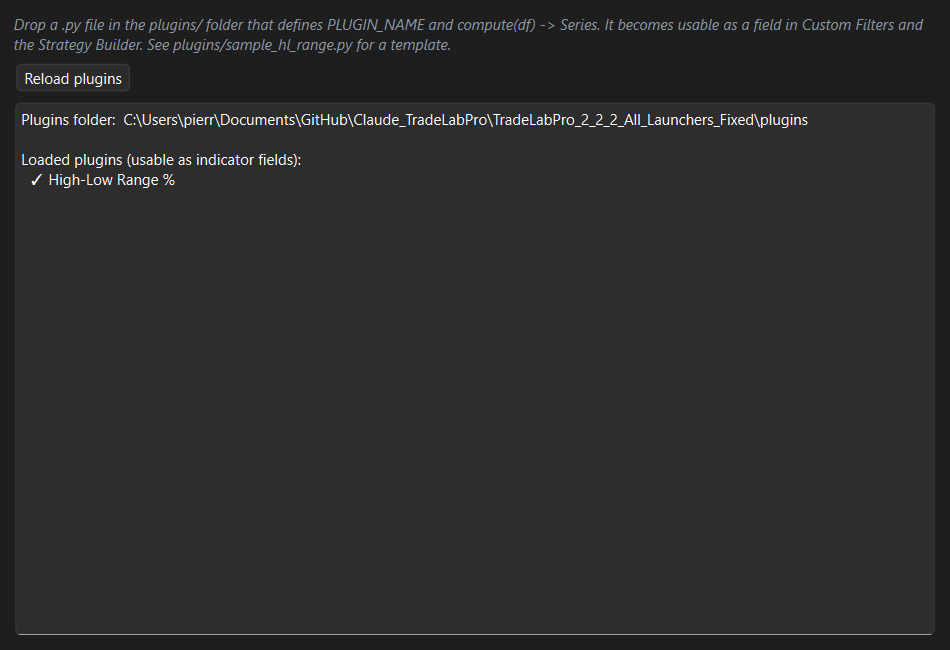
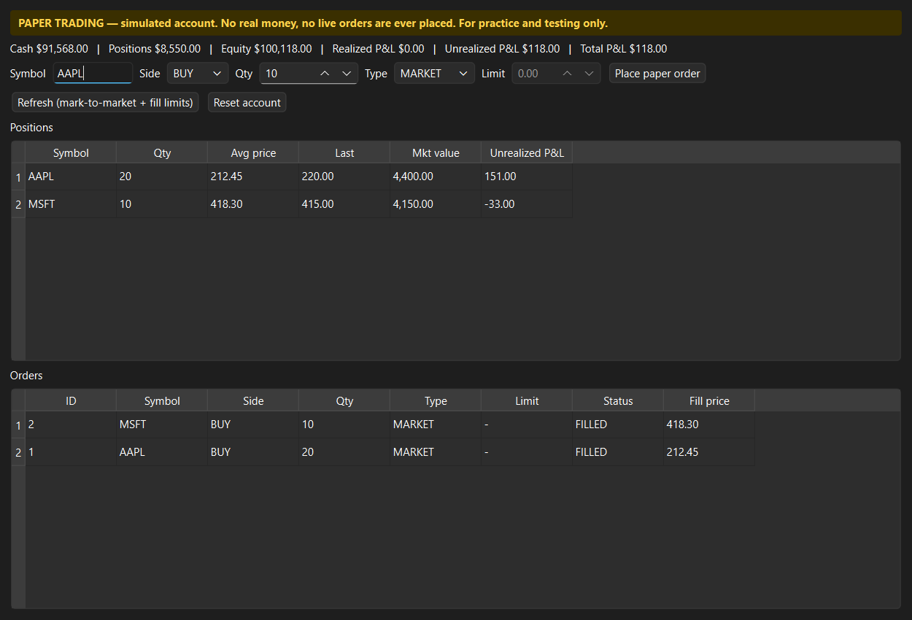
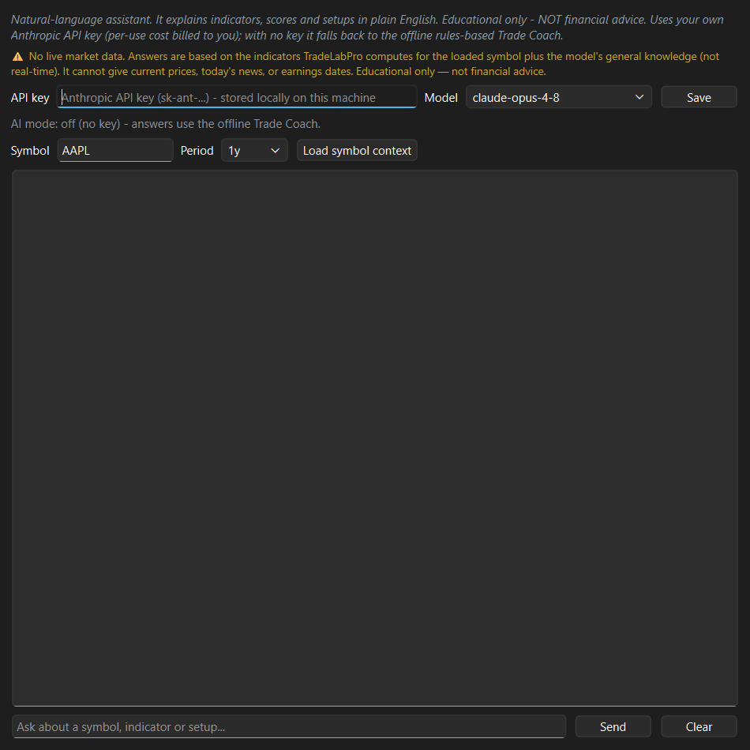

# TradeLab Pro — User Manual

**Version 2.46.1**

TradeLab Pro is a desktop trading **workstation** for the stock market: open on a
**Home** dashboard showing your book, a chart of its year so far, the market
read, the day's movers and the
dates your holdings have scheduled, scan the
market for setups, chart and analyze symbols, keep watchlists and a portfolio
(**import your positions from IBKR**, see the book's **risk analytics** in CAD,
read your ETFs through to the **companies inside them**,
and track the **dividend income** it pays), **project how long the money lasts**
in retirement, set price/indicator **alerts**, see a
whole market at a glance on a
**heatmap**, backtest strategies, build your own strategies and indicators
without code, **replay** history bar-by-bar, study a symbol's **seasonality**,
keep a **trade journal** (with IBKR import), have an **AI Coach** grade your
trades on process and tell you what to work on, **size positions by risk**,
practice with a simulated paper-trading account, and ask a built-in AI assistant
to explain what you're looking at.

> **Important — what this app is and isn't.** TradeLab Pro is an **analysis and
> practice** tool. It does **not** place real orders, connect to a live
> brokerage for trading, or move real money. Everything about *trading* in this
> app is **simulated**. (It can *read* your own IBKR trade history for the
> journal — that's read-only reporting, never order routing.) Nothing in it is
> financial advice. Always do your own research and consult a licensed
> professional before risking real capital.

---

## Table of Contents

1. [Installation & launching](#1-installation--launching)
2. [The main window](#2-the-main-window)
3. [A five-minute tour](#3-a-five-minute-tour)
4. [Home](#4-home)
5. [Scanner](#5-scanner)
6. [Charts](#6-charts)
7. [ETF Screener & Watchlists](#7-etf-screener--watchlists)
8. [Portfolio, Analytics, Dividends & Retirement](#8-portfolio-analytics-dividends--retirement)
9. [Alerts](#9-alerts)
10. [Heatmap](#10-heatmap)
11. [Market dashboard](#11-market-dashboard)
12. [Backtest lab](#12-backtest-lab)
13. [Chart replay](#13-chart-replay)
14. [Seasonality](#14-seasonality)
15. [Strategy builder](#15-strategy-builder)
16. [Plugins](#16-plugins)
17. [Paper trading](#17-paper-trading)
18. [Trade journal](#18-trade-journal)
19. [Coach](#19-coach)
20. [Risk & position sizing](#20-risk--position-sizing)
21. [AI assist](#21-ai-assist)
22. [Settings & your data](#22-settings--your-data)
23. [Tips & FAQ](#23-tips--faq)
24. [Glossary](#24-glossary)

---

## 1. Installation & launching

**Requirements:** Windows, Python 3.11+ (tested through 3.14).

**First-time setup:**
1. Run `install_requirements.bat` to install the Python dependencies.
2. Launch with `run_tradelab.bat` **or** double-click `START_TradeLabPro.vbs`.

The app opens maximized and remembers its window size and position between runs.

**Online vs. offline (data sources).** By default TradeLab Pro pulls market data
from **Yahoo Finance** (`yfinance`) when you're connected. With no internet, it
falls back to **deterministic synthetic data** so every screen stays usable for
practice and demos — the numbers are fake but consistent, so nothing crashes or
blanks out. You can also **choose the data source** in **Settings → Data source**
(e.g. force the offline synthetic source for a demo); see section 22.

---

## 2. The main window

The window is split into two halves:

- **Left — the tabbed control panel.** **Home** comes first — your book and the
  market in one screen — and the rest follow the
  trading process: **Market → Heatmap → News** (market context) → **Scanner →
  ETF Screener → Watchlists → Alerts** (find & watch) → **AI Assist → Risk → Paper Trading**
  (analyse, size & act) → **Portfolio → Analytics → Dividends → Retirement →
  Retirement Sim → Journal → Coach** (track & review) →
  **Backtest → Strategies → Replay → Seasonality → Plugins** (research/build) →
  **Notes → Links → Settings → Help** (utilities). The tab bar wraps to two rows
  so every tab is visible. **Help** is this manual, in a tab — the same one
  **Help → User Manual** (F1) opens in its own window.
- **Right — the chart workspace.** Always visible, and it follows the tab you
  are on: charts you open from the Scanner, Heatmap, Journal, or Replay (or type
  in directly) appear here as dockable panels, while **Retirement Sim** draws its
  projection in the same space. A **⛶ Full screen** button expands the chart to
  the whole monitor (Esc to retract).

Drag the divider between the two halves to rebalance the space. Each tab scrolls
internally if it needs more room than the window height, so the bottom of a tab
is always reachable on any screen size.

---

## 3. A five-minute tour

1. **Look at Home.** It's already loaded — your book's value, today's move,
   unrealized P&L and annual income, anything that needs attention, and how the
   market is reading. Nothing to click.
2. **Scan.** Open the **Scanner** tab, pick an exchange/list (e.g. USA), and click
   **Scan**. A ranked table of matching symbols appears.
3. **Map it.** Click **🗺 Map results** to see those symbols as a **Heatmap** —
   sized by market cap, colored green/red by % change, grouped by sector.
4. **Chart.** Double-click a Scanner row (or a heatmap tile) — it loads on the
   chart at right, with the company name and price at the top-left, candlesticks,
   moving averages, and Volume/MACD/RSI sub-panes.
5. **Save / alert.** Add a symbol to a **Watchlist** or **Portfolio**, or open
   **Alerts** and set "RSI below 30" to be notified when it triggers.
6. **Size the trade.** Open **Risk**, enter your account size, risk %, entry and
   stop — it tells you how many shares to trade and your R-multiple targets.
7. **Practice & journal.** Open **Paper Trading**, buy a few simulated shares,
   then **Journal** to review your win rate and expectancy (or import your real
   IBKR history).
8. **Get coached.** Open the **Coach** tab for a letter grade on how well you
   *executed* each journaled trade — and a short list of process habits to work
   on.
9. **Ask.** Open **AI Assist**, load a symbol's context, and ask "what is this
   setup telling me?" in plain English.

---

## 4. Home

The first tab, and the first thing you see. It answers the questions you
actually open the app to ask, without you having to click anything: **what is my
book worth, how did it move today, what income is coming, what moved most, what
is coming up, and is anything wrong?**

**It refreshes itself at startup.** Your portfolio loads as soon as the window
paints; the market pass follows a few seconds later in the background. By the
time you've looked at the window, the numbers are already there.

### The tiles

**Book value** · **Today** · **Unrealized P&L** · **Annual income** — in your
display currency (**CAD** by default; switch at the top right).

### This year

A chart of what the book has been worth since the year began, in your display
currency. The line is **green when the year is up, red when it's down**; the
dashed line is where the year started, and the header states the move in dollars
and percent along with the **deepest dip** along the way. Hover anywhere on the
line to read that day's value and how far it stood from the start.

The year is anchored to **last year's final close** whenever the price history
reaches that far back, so January's first move is measured from where the book
actually ended the year rather than from its own first bar.

> **This is a chart of what you hold, not a statement of your account.** It
> values **today's share counts** at every close since January — so a position
> you opened in March is valued back to January as though you had always held
> it, and **contributions, withdrawals, trades made during the year and
> dividends received are not in it**. An imported IBKR position carries a share
> count and an average price but **no trade date**, so nothing more accurate is
> available from that data; the note under the chart says so every time rather
> than letting the line be mistaken for a broker statement.

Two smaller honesty notes. The book is only valued on days **every** holding
traded, so a name that listed part-way through the year shortens the curve — when
that happens the chart **names the holding** responsible instead of quietly
starting the year in March. And in the first days of January, before there are
enough sessions to draw, it says so rather than drawing a line through two dots.

### Needs attention

Things worth knowing without asking for them:

- A holding **down more than 5%** on the day.
- A symbol with **no price data**, or a **missing FX rate** — named, so you know
  what's excluded rather than wondering why a total looks low.
- A position that has grown past **40% of the book**.
- **Look-through concentration** — a company that reaches 40% of the book once
  your funds are opened up, even if no single *position* is that large. See
  section 8.

### Today's movers

Each holding's move, biggest first. The **percentage is the stock's own move in
its native currency**, so a currency swing can't distort it; the **dollar figure
is converted** to your display currency. Click any row to chart it.

### Income

Average income per month, and the next payment expected — which holding, which
month, roughly how much.

### Coming up

The dates your own holdings have scheduled — when each next **reports earnings**
and when each next trades **ex-dividend**:

> **Coming up:** POW.TO reports in 3 days · KTOS reports in 8 days · RY.TO
> reports in 31 days · +1 more

Anything within three days is highlighted. Only the next few are listed; the
rest are counted.

**What it leaves out, on purpose:**

- **Dates already past.** An ex-dividend that happened last week is history, not
  something to act on.
- **Dates more than 45 days out.** Beyond about six weeks a date is trivia
  rather than something to know today, and estimated earnings dates that far
  ahead often move.
- **Anything not actually published.** Nothing here is inferred or estimated.

**A quiet line is normal.** ETFs have no earnings and most publish no calendar
at all, so a book held mostly in funds genuinely has little to show. Rather than
leaving a silence you would have to interpret, the line **names** the holdings
that had nothing: *"No calendar published for VTI, XDIV.TO, XIC.TO — funds
rarely have one."* That way an empty schedule never looks like a broken lookup.

> **No economic calendar.** CPI, PPI, central-bank decisions and analyst rating
> changes are deliberately **not** included. No data source wired into the app
> publishes them reliably, and a hardcoded list of dates goes stale without
> announcing it — a wrong date on a screen about real money is worse than no
> date at all.

### The market, in three lines

- **Market** — the read for each market scored (US, Canada), with breadth, VIX
  and the strongest and weakest sector.
- **World** — TSX, S&P 500, Nasdaq, FTSE and Nikkei, home market first.
- **Macro** — USD/CAD, oil, gold and the US 10-year: the rate your USD holdings
  translate through, the two commodities that dominate the TSX, and the yield
  every dividend payer is priced against.

Two things worth knowing about these lines. They show the **Market tab's own
numbers** — Home never computes a second, cheaper version, so the two screens
can't disagree. And a reading is **stamped with its age**: "updated 16:25" when
it's fresh, "as of 16:25" once it's over an hour old, so a stale number is never
presented as current. Until a reading exists it says *"reading the market…"*
rather than showing a placeholder.

The 10-year is quoted in **basis points** ("−4 bp"), not as a percentage change
of the yield, and is deliberately left uncoloured — green-for-up would suggest
rising rates are good news, which for a book of dividend payers is usually the
opposite.

> **Home assembles, it never recalculates.** Book value comes from the same
> engine as the Analytics tab and income from the same engine as the Dividends
> tab, so a figure on Home always matches the tab it came from. If a price can't
> be fetched, Home shows "—" rather than a fabricated balance.

---

## 5. Scanner

The Scanner filters the market down to symbols matching your criteria and ranks
them by a 0–100 **Score**.



### Running a scan
1. Choose which symbols to scan using the **exchange / list** selectors
   (shortcuts: USA, Canada, All, None; your own lists live under **My Lists**;
   ETFs are under My Lists, not Exchanges).
2. Set your filters (below).
3. Click **Scan**. Use **Stop** to interrupt a long scan.

### Filters
- **Price / Volume / Market cap** — minimum and maximum bounds.
- **Relative volume, RSI range, ATR% range** — momentum and volatility gates.
- **EMA trend / positive MACD** — require a trend condition.
- **Custom filters** — add your own conditions across 16+ technical fields
  (price, volume, RSI, ATR%, ADX, MACD family, EMAs, SMAs, Bollinger bands,
  price-vs-SMA20%, and any indicator plugins you've added). Each is
  Above / Below / Between a value, and all are AND-ed with the fixed filters.
- **Strategy** — the dropdown chooses which strategy scores and signals each
  symbol (e.g. EMA/MACD Trend, RSI Mean-Reversion, or any custom strategy you
  built). This drives the Signal and Score columns.

### Reading the results
Columns: **Symbol, Signal, Score, Conf%, Sample, Price, Volume, RelVol,
Market Cap, Cap, Sector, RSI, ATR%, EMA, MACD**.

- **Score (0–100)** — the strategy's overall read; rows are color-tiered by score.
- **Signal** — BUY / SELL / neutral per the selected strategy.
- **Conf% / Sample** — of the strategy's past BUY signals on this symbol, the
  fraction that were profitable 10 bars later, and how many signals that's based
  on. A high Conf% on a large Sample is more trustworthy than one on a tiny
  sample. A dash (—) means not enough history.
- **Cap** — Mega / Large / Mid / Small / Micro bucket.
- Error rows (Score 0) render in gray, with the error message on the Symbol
  cell's tooltip — so a scan failure never masquerades as a weak result.

Double-click a row to chart it. The buttons below add selected rows to a
Watchlist/Portfolio, load a chart, export the results, or **🗺 Map results** —
which sends the scan results to the **Heatmap** tab as a custom map (section 10).
The status line summarizes counts and a sector breakdown.

### Presets
Use the **Preset** combo to save, switch, and delete named scan setups (stored in
`data/setups/`). "Save As" creates a new one; the list stays in sync
automatically. **Open** loads a setup file from elsewhere on disk. You can also
**export** scan results.

---

## 6. Charts

The chart workspace on the right renders responsive, zoomable charts (built on
PyQtGraph).



### Loading & navigating
- Load a symbol by double-clicking a Scanner result, clicking a heatmap tile, or
  typing a ticker into the chart's own search box.
- **Period** and **Interval** selectors set the history length and bar size.
- **Pan** by dragging, **zoom** with the scroll wheel, and read exact values from
  the **crosshair** — a synced readout across the price, Volume, MACD, and RSI
  panes shows date/time and full OHLCV plus indicator values in the bottom status
  bar.

### The price header
Top-left of the price pane shows:
```
AAPL — Apple Inc.
$212.45   +1.32 (+0.63%)
```
The company name, then the **latest price** and its **day-over-day change**
(green when up, red when down). This is the last close of the loaded history, not
a live streaming tick.

### Chart types
**Candlestick, Heikin-Ashi, Line, Area.**

### Indicators
Click any entry in the on-chart **legend** (top-left) to open the **Indicators**
dialog — the legend *is* the editing entry point. From there you can:
- Add / remove **overlays** with tunable periods: EMA, SMA, Bollinger, VWAP,
  Pivot Points, SuperTrend, Ichimoku Cloud, Volume Profile, and any plugin
  indicators.
- Toggle the **Volume / MACD / RSI** sub-panes and tune their periods. A
  "Show all sub-panes" button restores any you turned off by accident.
- Toggle **BUY/SELL signal** markers (EMA-crossover confirmed by MACD).

### Dividend markers
For a symbol that pays a dividend, each **ex-dividend date** is marked with a
small diamond beneath its bar — hover one to see the amount paid per share. The
**trailing yield** also appears in the price header next to the price, e.g.
`$46.42   +0.24 (+0.52%)   ·   Yield 3.02%`. Both come from the same calculation
the Dividends tab uses, so the two screens always agree. Turn them off in the
**Indicators** dialog (*Show dividend markers*). A stock that pays nothing simply
shows neither.

### Drawing tools
Trendline, horizontal line, vertical line, rectangle, **Fibonacci retracement**,
and text notes. Drawings are **saved per symbol and timeframe**, so they're still
there when you come back.

### Multiple charts & layouts
Open several charts side by side as dockable panels; a switcher row (below the
toolbar) has one button per open chart, plus a small close (×) on each and a
**Reset charts** button to collapse back to one. You can save and reload named
chart **layouts**.

---

## 7. ETF Screener & Watchlists

The **Scanner** finds setups to trade. The **ETF Screener** answers the slower
question that comes before a long-term holding — *which fund, and how much of
it* — and it is built for the way people actually answer that: comparing a dozen
funds side by side and nudging percentages until the mix looks right. It sits
between Scanner and Watchlists because that is where the decision falls.

**The table.** One row per fund, one column per thing you compare on: name,
category, region, what the fund holds in **Canada / the US / international /
bonds / commodities**, the **MER**, the **distribution yield**, returns from
**one month to ten years**, **volatility**, **worst drop**, the **Risk**
rating, free-text **notes**, and the **account** you'd hold it in.

**What "Risk" means here.** Every fund and ETF sold in Canada must rate its
risk with one prescribed measure and print it in its *Fund Facts*: the
annualized standard deviation of **monthly** returns over **ten years**, put
into five bands — under 6% *Low*, 6–11 *Low to medium*, 11–16 *Medium*, 16–20
*Medium to high*, 20 and over *High*. This column computes that same figure
from the same prices, so you can check it against the fund's own document
instead of taking the app's word for it. **Hover the cell** and it tells you
the standard deviation and how many years went into it.

Two things it is not. It is **not** the Volatility column beside it: that one
samples daily over whatever history a fund has, which is the right measure for
comparing funds inside the app and the wrong one for these bands — VFV reads
16.5% daily but 12.9% the regulator's way, which is a different band. And it
rates **volatility only**: not credit risk, liquidity, concentration, currency,
or the chance of permanent loss. A quiet bond fund rates *Low* right up until
an issuer defaults.

A fund without ten years is rated on what it has and the tooltip says so; the
published methodology fills a short history with a reference index and this
does not, so a young fund can differ from its document. Under three years
nothing is rated.

**% Commodity** is the bucket for what has no geography — bullion in a vault.
Companies that *mine* it are equities and belong in the regional columns, with
the theme named in Category. Gold, silver and lithium funds all land wherever
that rule puts them. Click any cell in a
column you own and type. Percentages go in the way you'd say them — `20`, `20%`
and `62.5 %` all mean the same thing — and the cell redraws as `20.0%` so what
you typed and what was stored can never disagree. Clearing a number stores
nothing rather than zero: a blank means "not known", and a zero would drag every
total that touches it.

The **Ticker column stays pinned** to the left edge: scroll thirty columns to
the right and you can still see which fund the Sharpe ratio you're reading
belongs to. **Double-click a ticker** to load that fund on the chart — it
charts the *Yahoo* symbol, so `VFV.TO` rather than `VFV`, which is the one with
prices.

**Add and remove.** Type a ticker, optionally the symbol **Yahoo** knows it by
(TSX listings end in `.TO`), and **Add**. Leave the Yahoo box empty and the
ticker is used as-is. **Remove selected** deletes the highlighted rows. The
buttons wrap onto a second row when you widen the chart, rather than sliding
off the edge.

**Returns and risk, in one click.** **Refresh returns & risk** downloads eleven
years of history for every fund and recomputes the return columns — annualized
past a year, with dividends reinvested — plus volatility, worst drop and Sharpe.
It runs in the background with a progress bar and a **Stop** button; a fund
Yahoo doesn't recognise is counted and skipped rather than stopping the run.
**The refresh never touches what you typed**: category, weights, risk, notes and
your allocations are yours.

**Each allocation column totals under the table** — green when it reaches 100%,
amber while it doesn't. The **⛶ Full screen** button hands the whole window to
the table by hiding the chart; click it again to put the chart back.

**Build… fills a column by a rule.** Rather than typing thirty weights, pick
the column, tick which **published risk bands** count as eligible, choose
**equal weight** or **inverse volatility** (calmer funds get more), set a cap
per fund, and decide whether to keep only one of two funds that buy the same
market — the cheaper one, since same exposure at less cost is a rule and not a
preference. A preview shows exactly what it would write before it writes
anything.

Everything the rule uses is a column already in the table, and every choice is
yours: the app applies arithmetic, it does not pick funds. The bands come
pre-ticked to those whose *names* match the column you're filling, which is a
naming correspondence and nothing more — change them. Afterwards every cell is
editable as usual, and the whole column is replaced rather than merged, so a
weight left from an earlier run can't survive into a mix the rule no longer
puts that fund in.

**Three allocations, side by side.** **Low risk**, **Mid risk** and **High
risk** are weight columns for you to fill in, totalled under the table: what
each one holds by region, its weighted MER, its weighted distribution yield,
its weighted ten-year return, and whether the weights add up to 100% (`OK ✓` or
*adjust*). Change a weight and the totals move with it. The **Allocation**
dropdown decides which of the three the analyses below act on.

**Two things the tab deliberately won't do.** A fund that listed five years ago
has **no** ten-year return, so that cell stays empty instead of annualizing
history it doesn't have — and a refresh that can't compute a figure leaves the
one already there rather than blanking it. And when a total rests on only part
of your allocation, it says so — `(of 50% of the allocation)` — because counting
the funds that lack the figure as zero would report your mix as worse than it
is.

**Three questions the tab can answer about an allocation.** Pick which one in
the **Allocation** dropdown, then:

- **Target vs held** prices the positions on your **Portfolio** tab and lays
  them beside the target: how far each fund has drifted, and the dollars it
  would take to close the gap. The percentages are of the **whole book**, and
  anything you hold that has no target is named — a plan measured only against
  the funds it happens to mention would report a book as on-plan while half of
  it sat somewhere the plan never mentioned. The dollar figure is arithmetic on
  your own target; it knows nothing about commissions, the tax on a sale, or
  whether the trade is worth making.
- **What this mix holds** opens every fund up to the companies inside it. A
  bank held inside three index funds is one exposure, not three. Sources
  publish only each fund's largest holdings, so the rest is reported as
  unallocated rather than spread across the names on screen — every percentage
  is a floor. A fund that is really a wrapper around another fund is opened
  **twice**: VFV.TO publishes one holding, VOO.TO at 100%, and answering "you
  own VOO.TO" would be true and useless.
- **Compare selected** plots the funds you've highlighted on one chart, each
  restated to 100 at the first date they *all* share, so the lines answer one
  question: which grew fastest over the same period.

**The Low vol column is a test you set.** Type a threshold next to **Low vol ≤**
and every fund whose *measured* annualized volatility is at or below it is
ticked. It is arithmetic on two numbers — your threshold and the volatility the
refresh computed — so it is repeatable and it changes the moment you move the
threshold. It marks which funds pass; it never says how much to hold, and it
does not fill in the allocation columns. A fund that has never been refreshed
reads **—**: not measured, which is not the same as failing the test. Once
anything passes, the filter dropdown gains a *Passes low vol* entry.

**An overlap warning appears on its own**, under the totals, when two funds in
the allocation buy the same market and both carry weight (VCN and XIC, VIU and
XEF). That is one market at twice the trading cost rather than
diversification — unless you're holding them in different accounts on purpose.

**Add selected to Watchlist / Portfolio** work like the Scanner's. A fund added
to the Portfolio arrives at **0 shares**: this tab knows what you want to hold,
never what you actually bought. **Export CSV** writes every column in stored
units (a rate is `0.25`, not `25.0%`) so a spreadsheet gets the number rather
than the formatting. The **Filter** box narrows the table by ticker, name,
category, region or notes, and the dropdown beside it offers the values the
table actually contains — every category, region, account and currency in it.
Below those sit the **exposure** entries (*Holds Canada*, *Holds United
States*, *Holds gold*…), which read the percentage columns rather than the
region label: XAW is labelled *Global* and is 60% US, so the label alone would
hide it from a search for US exposure. The two narrow together, and filtering
hides rows without changing the totals — what you can see and what you hold are
different things.

**The notes at the bottom** record which CAD listings stand in for which US
funds (XUU for VTI, QQC for QQQ, MNT for IAU, and so on) and which have no CAD
twin at the same return. That is the reasoning behind holding one of a pair
rather than both — reference text, not a recommendation.

**Starting from an existing workbook.** `python tools/import_etf_screener.py
<file.xlsx>` loads a `Portefeuille_FNB.xlsx`-shaped sheet into the tab in one
pass (headers on row 7). It's idempotent — running it twice doesn't duplicate
anything — but it is an *import*, not a sync: values in the file overwrite the
matching cells in the app. A French workbook is **translated on the way in**
(category, region, account and per-fund notes), so the table doesn't end up an
English grid full of French cells; anything the translation table doesn't know
is carried across word for word rather than guessed at. Needs
`pip install openpyxl`.

Risk labels and the suggested account are your own notes and a general guide,
not the app's opinion and not tax advice.

### Watchlists

Track symbols you care about. The table shows **Item, Symbol, Last, Change %,
Purpose**. You can import and export watchlists. Add symbols directly from Scanner
results, or by right-clicking a **Heatmap** tile → *Add to watchlist*. Selecting
an entry can load it on the chart.

---

## 8. Portfolio, Analytics, Dividends & Retirement

The **Portfolio** tab is a holdings record: **ID, Portfolio, Symbol, Shares,
Entry**. Add positions (e.g. from a Scanner result), group them by portfolio
name, and export; **click any row to chart its symbol**. This is a
**record-keeping** ledger for positions you hold elsewhere — it does not place
or track live orders. Your portfolio also feeds the
**Heatmap** (Portfolio map) and the **Risk** tab's sector-exposure view. For
simulated order entry and P&L, use **Paper Trading** (section 17).

### Import your positions from IBKR (read-only)

Instead of typing holdings in, you can pull your current open positions straight
from Interactive Brokers. On the Portfolio tab, under **Import from IBKR**:

- **Positions file (CSV/XML)…** — export an Activity Statement or Flex report
  that includes the **Open Positions** section (CSV or XML) and pick the file.
- **Fetch positions (Flex)** — a direct pull over the IBKR Flex Web Service,
  reusing the **token and query id** you saved in the Journal tab (section 18).
  Your Flex query's Open Positions section must include at least Symbol, Quantity
  and Cost Price (add Currency / Listing Exchange too for the cleanest mapping).

Imported holdings land in a portfolio named **IBKR**; each import **replaces** the
previous one, so re-importing never creates duplicates, and your manually-added
positions are left alone.

> **Read-only.** This reads what you hold — it never logs in to trade, routes
> orders, or moves funds.

**Ticker mapping.** IBKR reports bare local tickers, which can point at the wrong
listing on the app's data source (e.g. US `XDIV` at ~$30 vs Toronto `XDIV.TO` at
~$46 — and some US names even have a Canadian "CDR" at the same ticker). The
importer maps each holding to the correct listing using its exchange/currency and,
as a fallback, by matching each candidate's price to your cost basis, so a mixed
Canadian/US book prices correctly.

### Analytics — your book's risk profile

The **Analytics** tab treats your holdings as one book. Pick a **Benchmark**
(default SPY), a **History** window, and a display **Currency** (default **CAD**),
then click **Analyze**. It fetches prices in the background and shows:

- **Metric tiles** — total value, unrealized P&L, return vs the benchmark (both
  named, e.g. "+47.0% vs SPY +19.2%"), beta, annualized volatility, and max
  drawdown.
- **Holdings table** — each position's native currency (**Ccy**), last price,
  market value, weight of the book, unrealized P&L, and its **Return** over the
  selected History window. **Click any row to chart that symbol.**
- **Concentration** — the largest position, the top-3 share, and the *effective
  number of positions* (a book split evenly across 5 names has an effective N of
  5; one dominated by a single name is far lower).
- **Correlation matrix** — how your holdings' daily returns move together
  (red = they move as one, concentrated risk; green = they diversify each other),
  plus the average pairwise correlation.

**Currency (multi-currency books).** The display mirrors how IBKR shows a
mixed-currency account:
- **Per-share prices stay native** — Last and Avg entry show each holding's real
  quoted price (a US stock shows its US price, the one you recognize).
- **Dollar amounts are in your chosen currency** (CAD by default) — market value,
  cost, unrealized P&L and the total are converted with the live FX rate, so the
  total matches your broker's Net Liquidity and everything is apples-to-apples.
- **Unreal %** is the stock's own price move (unaffected by FX), and choosing
  **Native (mixed)** shows each holding entirely in its own currency instead.

**Unreal % vs Return.** Two different questions: **Unreal %** is *your* gain
since your entry price; **Return** is how the stock itself performed over the
selected History window, regardless of when you bought — compare it directly
to the benchmark's return for the same period. A stock can show a big Return
but a small Unreal % if you bought partway through its run.

**Honest about missing data.** If a price download fails — a stock, the
benchmark, or an FX rate — Analytics shows "—" and names the symbol in a note
("No price data for X — excluded from totals") rather than substituting the
offline synthetic data used elsewhere for demos. Likewise, unrealized P&L
excludes any unpriced holding's cost, and if one holding's short history
shortens the common analysis window, the tab says so ("⚠ Window shortened by
SYMBOL's limited history").

> Analysis only — the Analytics tab never places or tracks live orders, and the
> figures are not financial advice.

### Look-through exposure — your book by company, not by position

A book measured position-by-position can understate what it actually owns. If you
hold a bank outright **and** hold two index ETFs that each carry that bank as
their top position, that is **one concentrated exposure reported as three
diversified ones**.

The **Look-through exposure** section (below the holdings table, filled in when
you click **Analyze**) opens your funds up and restates the book by *company*:

| Column | What it means |
| --- | --- |
| **Company** | The underlying company, whether you hold it directly, inside a fund, or both |
| **Exposure** | Its total value across every route you own it |
| **% of book** | That value as a share of the whole book |
| **Held directly** | The part that is your own position ("—" if you own it only through a fund) |
| **Also inside** | Which of your funds carry it |

**Click any row to chart it** — including companies you hold only inside a fund
and have no position in.

Below the table, a **Sectors** line gives the sector weights of the entire book:
funds contribute their published sector breakdown, individual holdings contribute
their own sector, and anything unclassified stays visible rather than being
quietly dropped.

**A worked example.** A CAD book holding XDIV, XIC and RY directly: RY shows as a
**28% position** in the holdings table, but **33% of the book** in look-through —
because both ETFs hold RY as their largest position. XDIV is the biggest
*position*; RY is the biggest *company*. Two different questions, two different
answers.

> **Every figure here is a floor, never a total.** Data sources publish only a
> fund's **top ~10 holdings**, so whatever sits below that is reported separately
> as unallocated rather than being spread across the names you *can* see — which
> would overstate every one of them. The section tells you how much is
> unaccounted for. A fund with no holdings data at all is **named** and counted as
> itself, so the book never looks more diversified than the data supports.

### Dividends — the income your book pays

The **Dividends** tab answers "what do my holdings actually pay me?". Pick a
display **Currency** (CAD by default) and click **Refresh**:

- **Headline tiles** — total **annual income**, the **average per month**, the
  **portfolio yield**, the **yield on cost**, and how many holdings pay at all.
- **Income by holding** — each position's payment **frequency** (monthly,
  quarterly, …), its **dividend per share** for the year, the **annual income**
  it produces, its **yield**, its **yield on cost**, and its **growth**.
  Click a row to chart the symbol.
- **When it arrives** — a month-by-month calendar of expected income, shaded so
  the heavy months stand out, listing which holdings pay in each.

**Yield vs. yield on cost.** *Yield* is the dividend divided by today's price —
what a buyer gets if they buy now. *Yield on cost* divides by what **you** paid,
so it's higher whenever the price has risen since you bought; it's highlighted
when your cost basis is the better one. Both are computed from each holding's
own currency, so the display currency doesn't change them.

**How the annual figure is worked out.** The app annualizes the **most recent
payment** at its detected frequency, rather than simply summing the last twelve
months. That way a recent raise (or cut) is reflected immediately instead of
being averaged away by older, smaller payments.

> **A projection, not a promise.** The calendar and the annual figure are
> extrapolated from past payments. Companies can raise, cut, or suspend a
> dividend at any time. Reporting only — not financial advice.

### The Retirement tab — a workplace plan the app can't connect to

A group RRSP or a pension is the one account TradeLab can't fetch. Its funds
have no ticker and no public price: the unit values live behind the plan
administrator's login and nowhere else. The **Retirement** tab is built around
the only input that actually exists — what your statement says, a few times a
year — and it never asks for your login.

**Paste your statement.** Copy the fund table straight off the plan's website
into the *Enter a statement* box: one fund per line, category headings ignored.
A line with two numbers is read as units and unit value; one number is read as a
balance. Canadian formatting works (`12 049,25 $`), so does American
(`1,234.56`). Click **Read** to see what was understood — **nothing is saved
until you click Save**. Pasting the same date again corrects that statement
rather than adding a second copy.

**Paste your fund fact sheets.** Most plans publish, per fund, its return
against **its own benchmark** over 3 months to 10 years. That is better than
anything this app can compute: it's the fund's real benchmark, often a blend no
ETF replicates, over horizons you could never rebuild from statements. Paste a
sheet's compound-returns table — the header row plus the *Fonds* / *Indice*
rows — pick the fund, and click **Read sheet**.

**Set the plan fee. This is the part that changes answers.** Fact sheet returns
are struck **before** the plan's investment management fee. Type that fee once
and every excess figure gains an *After fee* twin. A fund that beats its index
by 0.03 points and charges 1.5% did not beat it for you — it lost by about 1.5
points. Without the fee column that fund looks like a winner.

**Two returns, and they answer different questions.**

| Column | What it means | When to use it |
|---|---|---|
| **Fund return** | The unit value moving. Your contributions cannot flatter it. | Comparing your funds against each other |
| **Your return** | An XIRR over what you paid in and when | Checking how your own money did |

Employer contributions are tracked separately: a 100% match is a payroll
benefit, not investment performance, and mixing the two inflates the figure.

**The chart** restates every fund to 100 at its first statement, so the one
lagging is the line at the bottom — no numbers to read. It uses unit values
only: a dollar balance rises when you contribute, and drawing that as
performance would mislead.

> **One statement is a balance, not a return.** With a single date, every return
> column shows "—" with the reason. That's arithmetic, not a bug — a price does
> not imply a return, you need two. Your first paste starts the clock; the
> second answers the question.

> **What it won't do.** It won't connect to your plan, and it won't tell you
> which fund to hold. Returns, benchmarks and fees are laid side by side as
> facts. Reporting only — not financial advice.

### The Retirement Sim tab — how long the money lasts

The **Retirement** tab beside it *tracks* a plan: what it was worth, what it
returned. **Retirement Sim** *projects*. Given what you hold and what you
assume, it writes one row per calendar year — incomes, the forced RRIF minimum,
real Québec **and** federal tax, and what has to come out of capital to cover
the spending — up to the age you name.

**Three tables to fill in.** Add and remove rows with the buttons under each.

| Table | Columns | Notes |
| --- | --- | --- |
| **People** | Name, Age | One row per person. Every **Owner** elsewhere has to match a Name here exactly, or the app can't tell whose age applies. |
| **Accounts** | Account, Kind, Balance, Owner | **Kind** is `registered` (REER/FERR/FTQ), `tfsa` (CELI) or `taxable` (non-registered). Balances accept `$` and commas — `$164,000` reads fine. |
| **Incomes** | Income, Owner, Per year, Starts, Ends, Indexed | **Per year** is what it's worth **today**. **Starts** / **Ends** are the owner's age; a blank End means for life. A wage is just an income that ends. |

**The Indexed column decides whether a cheque grows.** `Yes` (or a blank cell —
the common case) means it rises with inflation, which is what the RRQ, the PSV
and the AOW do by law. Type `No`, `non` or `fixe` for a fixed private pension:
it keeps paying the same number of dollars for thirty years, and loses about
half its worth doing so.

**The controls along the top.**

| Control | What it does |
| --- | --- |
| **Spending** | Household spending per year, in today's dollars — it grows with inflation from there. **The input that moves the answer more than any other.** |
| **% return** | The return as a fund reports it, with inflation still in it. 5 means five percent. |
| **% infl** | Inflation, projected explicitly. It grows the indexed benefits, the spending, and the tax brackets. |
| *= x.xx% real* | What the return leaves after inflation. Fisher, not subtraction: 5% at 2% is **2.94% real**, not 3%. |
| **% vol** | How much the return varies year to year — only used by **Run many paths**. |
| **to age** | How far to project. The horizon runs from the oldest person's age to this one. |
| **% split** | How much eligible pension income to move to the lower earner (0–50%). |
| **Today's $** | Read the finished table in today's purchasing power instead of each year's. See below. |
| **paths** | How many return orderings **Run many paths** uses. |

**What a run gives you.** *Run projection* fills the table below — **Year,
Ages, Income, RRIF minimum, Tax, From capital, Unfunded, Closing** — and draws
the closing balance in the right-hand pane where the chart normally sits. Any
year the plan can't fund is shown in red, and **the projection keeps going past
the year it fails** rather than stopping and leaving you to guess at the rest.
The status line says the age the money lasts to, or the age it runs short at
and by how much.

*Income* counts your incomes only; the forced withdrawal has its own column so
you can see what arrived because you needed it and what arrived because the law
said so. Capital is drawn **in the order the accounts are listed** — reorder the
rows to change it. Nothing here picks a withdrawal strategy for you.

**Which dollars you are reading.** The projection runs in the dollars of the
year each thing happens: the RRQ grows the way it really does, the spending
rises to match, and the balances are the numbers that would appear on a
statement. The cost is that "$1.2M in 2055" is not a figure anyone can price —
so tick **Today's $** and the same run is re-read in today's purchasing power.
It *re-reads*, it does not re-run: every row carries its own inflation factor,
so the two views can never disagree about what happened, only about how it is
priced. The toggle covers the many-path bands and the chart too, including a
run you saved months ago.

**The tax is a real model, not a rate.** Every 2026 figure was read off
canada.ca and revenuquebec.ca, and each carries its source. Each person is
taxed **as a person** — two basic personal amounts are worth more than one — with
the age amount from 65, the pension income amount, Québec's reduction of the age
amount on **family** net income, and the Québec abatement. The brackets are
indexed along with everything else, because both governments index theirs;
freezing them would invent bracket creep that will not happen. **Only eligible
pension income is split**: a wage can't be, and the RRQ has its own separate
mechanism.

**The forced RRIF minimum.** From the year an account's owner turns 71, a
registered account pays out the CRA's prescribed minimum whether the spending
needed it or not, and it is taxable to **that account's owner** — a couple's
minimums are two different numbers, not one.

**Run many paths.** One average return says nothing about the *order* returns
arrive in, and order is what decides a drawdown: losing 20% in the first two
years of withdrawing is not the same as losing it in the last two, because money
taken out at the bottom never comes back. This runs the same plan over hundreds
of orderings and reports **Worst 10% / Median / Best 10%** per year, plus the
share of paths **still solvent**, with the 10–90 band shaded behind the median
on the chart. The draw is seeded, so the same inputs give the same answer twice.

**Save inputs** writes the three tables and every control to the database, so
the plan is there next launch. **Save sim** keeps the current run on the chart
as the line to compare against — it stays through later runs and through closing
the app, until you press it again; a baseline that moved with every experiment
wouldn't be one. **Clear saved** removes it.

> **A success rate is the share of *simulated* paths under assumptions you
> chose** — not a probability that a retirement works. Move the spending by five
> thousand and it shifts more than any market will. Returns are drawn from a
> normal curve, which has **fewer very bad years than markets actually do**.

> **It computes; it does not advise.** Spending, return, inflation, the age each
> pension starts, how much pension income is split, the order accounts are drawn
> from — every judgement is an input you type. Nothing in this tab picks a
> strategy, recommends a withdrawal rate, or says whether a plan is good. Not
> financial advice.

> **What it deliberately does not model.** A **non-registered** account is
> treated as tax-free on withdrawal — the app doesn't track an adjusted cost
> base, and inventing a capital gain would be a guess, so that column is
> optimistic if you hold much outside registered plans. The **OAS/PSV recovery
> tax** (clawback) is not applied. Deferring a pension is **not** grossed up for
> you: type the amount that applies at the age you start it. And the tax table is
> **2026** — it is meant to be edited each year, and if indexation ever stops,
> the whole projection is optimistic.

---

## 9. Alerts

Get notified when a symbol meets a condition — without watching the screen.

**How it works.** Pick a symbol and build a condition using the same builder as
the Scanner (price, RSI, MACD, EMA/SMA crossovers, VWAP, and every other
indicator, including plugins). A background poller checks it on a timer and, when
it triggers, pops a **desktop notification**, logs it in the tab, and updates the
alert's status.

**Edge-triggered.** An alert fires once when the condition *crosses* from false to
true (e.g. "RSI Below 30" fires as RSI drops through 30), not repeatedly while it
stays true. Two modes:
- **Recurring** — re-arms once the condition releases, so it can fire again on the
  next crossing.
- **Once** — fires a single time, then turns itself off.

**Controls.** Add an alert (optionally pick a symbol from your watchlist),
enable/disable or remove selected ones, **Check now** for an immediate pass, and
turn on **Auto-check** with an interval (15 s – 1 h). Triggered alerts appear in
the in-panel log. Alerts persist between runs (`data/alerts.json`).

> Alerts are an analysis aid only — they never place orders.

---

## 10. Heatmap

A whole market at a glance, Finviz-style: every stock/ETF is a **tile sized by
market cap** (or dollar volume) and **colored green→red by its % change**, grouped
into sector blocks.

**Pick what to map (Market dropdown):**
- **US / Canada presets** — Mega/Large caps, NASDAQ, NYSE, TSX (and expanded TSX).
- **ETF / index maps** — US Sector ETFs (SPDRs), Index & asset ETFs, all US ETFs,
  Canada ETFs. Funds are sized by **AUM** and grouped by fund **category**.
- **World – Large caps** — major global companies (ADRs), auto-grouped by country.
- **Watchlist** and **Portfolio** — map your own lists.
- **Scanner results** — appears automatically when you use **🗺 Map results** on
  the Scanner.

**Theme baskets.** The **Theme** dropdown maps a curated basket — AI, Semiconductors,
EV & Battery, Cloud & SaaS, Cybersecurity, Biotech, Renewable Energy, Fintech,
E-commerce, Defense & Aerospace, Gaming, Social Media. A theme overrides the
Market while selected.

**Period.** The **Period** dropdown sets the window the color represents:
1 Day / 1 Week / 1 Month / 3 Month / 6 Month / 1 Year / 3 Year / 5 Year / 10 Year
/ YTD. Change it and the map re-colors.

**Group by.** Sector, Industry, Country, or None.

**Reading & navigating.**
- **Left-click** a tile to chart it; **right-click** for *Open chart* / *Add to
  watchlist*. Hover for a tooltip (name, sector, industry, country, price, %
  change, size).
- **Scroll to zoom** in on dense maps — tiles grow while labels stay a readable
  size, and tickers that were too small to show simply appear. **Drag to pan**,
  **double-click** empty space to fit again.
- **Auto-refresh** reloads the map on a timer (15 s – 1 h) so it tracks the day.
- **Size by** (market cap / dollar volume) and **Max** (tile cap) tune the view.

---

## 11. Market dashboard

A one-glance read on overall conditions:
- A color-coded **macro headline** with a 0–100 "is it a good day to trade" read
  and the reasons behind it.
- A **sector-breadth table** across 11 SPDR sector ETFs: **Sector, ETF, Change %,
  vs 50-day**, plus a breadth summary line (how many sectors are above/below
  their moving averages).
- A regime-symbol table that feeds the read.

Use this before scanning to gauge whether the broad market is with you or against
you.

**It also feeds Home.** Refreshing this tab updates the market, world and macro
lines on the **Home** tab (section 4) with these exact numbers — Home displays
this read rather than computing its own, so the two can never disagree. At
startup the app warms this pass in the background a few seconds after your
portfolio loads, so Home fills itself in without you opening this tab.

---

## 12. Backtest lab

Test a strategy against historical data.



Four sub-tabs:

- **Single** — run one strategy on one symbol; see metrics (win rate, total
  return, profit factor, **max drawdown %**) and the full trade list (Entry Date,
  Exit Date, Entry, Exit, Return %).
- **Multi-Symbol** — the same strategy across many symbols, aggregated:
  Symbol, Trades, Win rate %, Total return %, Profit factor, Max drawdown %.
- **Optimize** — sweep a single parameter to see which value performed best.
- **Walk-Forward** — test across rolling time windows (Window, From, To, Trades,
  Win rate %, Total return %) with a consistency score, to check a strategy isn't
  just curve-fit to one period.

Each tab includes plain-language hints and color-coded verdicts that interpret
the numbers for you.

> **Backtests describe the past, not the future.** Good historical numbers are
> necessary but not sufficient. Watch the sample size, the max drawdown, and
> whether results hold up across walk-forward windows.

---

## 13. Chart replay

Practice reading a chart with the future hidden — a bar-by-bar "replay" of history.

1. Enter a **Symbol** and **Period**, choose **Start at bar N** (how many bars to
   reveal first), and click **Load replay**.
2. Use the transport controls: **▶ Play / ⏸ Pause**, step **◀ / ▶** one bar,
   **⏮** back to the start, **⏭** reveal everything, and a **Speed** control
   (0.5× – 8×).
3. **Scrub** anywhere with the slider.

Because only the revealed bars are shown, indicators recompute on those bars
alone — there's genuinely **no look-ahead**, so it behaves exactly as the chart
would have live. It plots into your main chart workspace, so overlays, sub-panes,
and drawings all work.

---

## 14. Seasonality

See how a stock has historically behaved by the **calendar** — whether the month
you're in has tended to be kind or cruel to that name.

**How to use it.** Enter a **Symbol**, pick how much **History** to analyze
(2y / 5y / 10y / max), and click **Analyze**. The data is fetched in the
background (the window stays responsive), then three tables and a plain-English
headline fill in.

**The headline** answers the question directly, for example:
```
SPY — Over 10 years of history, July has been historically strong:
it averaged +1.8% with a 70% win rate (10 occurrences).
```
It also names the historically strongest and weakest months overall.

**By month** *(the centerpiece)* — one row per calendar month with:
- **Avg %** — the average month-over-month return for that month across every
  year in the sample. This column is a **green→red heatmap**, so strong and weak
  months jump out at a glance.
- **Win %** — how often that month closed higher.
- **Best % / Worst %** — the best and worst single occurrences.
- **Years** — how many years of that month are in the sample (more = more
  trustworthy).

The historically strongest and weakest months are shown in **bold**.

**By weekday** — the same average-return and win-rate read for Monday through
Friday (day-of-week seasonality).

**By year** — a year-by-year performance table (each year's return from its first
to its last close), most recent first.

> **Descriptive, not predictive.** Seasonality summarizes what price *did* in
> past calendars — it does **not** forecast the next one. A "strong July" is a
> historical tendency, not a promise, and small samples (few years) are weak
> evidence. It's a context tool, not a signal, and it's not financial advice.

---

## 15. Strategy builder

Build your own BUY/SELL strategies **without code**:



1. Add **condition blocks** for entry (BUY) and exit (SELL) — e.g. "RSI Below 30",
   "EMA 9 Above EMA 21", "Price Above SMA 200".
2. Conditions support **field-vs-value** and **field-vs-field** comparisons (for
   crossover-style rules).
3. **Save** the strategy — it's stored in `data/strategies/` and immediately
   appears in the Scanner and Backtest **Strategy** dropdowns, running exactly
   like the built-in strategies.

The available fields include the full indicator library (Stochastic, Williams %R,
CCI, ROC, OBV, MFI, VWAP, and more), each period-parameterized with sensible
defaults.

---

## 16. Plugins

Extend TradeLab Pro with **custom indicators** written in Python:



- Drop a `.py` file in the `plugins/` folder that defines `PLUGIN_NAME` and a
  `compute(df)` function returning an indicator series.
- It's auto-discovered at startup (and via the **Reload** button on this tab) and
  registered as an indicator field (`plugin:<name>`) usable in Scanner custom
  filters, the Strategy Builder, and chart overlays.
- The Plugins tab lists every plugin as loaded-OK or errored (errors are shown,
  never fatal). A bundled `sample_hl_range.py` is included as a template.

> **Plugins vs. data sources.** A *plugin* is a local custom **indicator** — it
> never connects to anything. Choosing where prices come from is a separate
> **data source** setting (section 22).

---

## 17. Paper trading

A fully **simulated brokerage account** for practice — the safe way to rehearse
order entry and watch P&L behave.

> **Simulated only.** No real money moves and no live orders are ever placed.
> Everything fills against a local ledger inside the app. A prominent amber banner
> on the tab is your reminder.



**Starting out:** the account begins with **$100,000** in simulated cash. It
persists between runs (in `data/paper_account.json`).

**Placing an order:**
1. Enter a **Symbol**, choose **BUY** or **SELL**, set the **Qty**, and pick
   **MARKET** or **LIMIT**.
2. **Market** orders fill immediately at the latest price. **Limit** orders rest
   until the price crosses your limit — click **Refresh** to fill any that have.
3. The order appears in the **Orders** table (with status and fill price).

**Watching your account:** the summary line shows **Cash, Positions value,
Equity, Realized P&L, Unrealized P&L, Total P&L**. The **Positions** table marks
each holding to market (Symbol, Qty, Avg price, Last, Market value, Unrealized
P&L). Both long and short positions are supported with proper average-cost and
realized-P&L accounting.

**Refresh** re-marks positions to the current price and fills any crossed limit
orders. **Reset account** wipes everything back to the starting cash (with a
confirmation). You can pull your paper fills straight into the **Trade Journal**
(section 18).

---

## 18. Trade journal

Log your trades, tag them, and review what actually works.

**Log a trade.** Enter symbol, side (Long/Short), quantity, entry, an optional
**stop**, a strategy name, tags, and notes. Each trade shows **P&L, P&L %,
R-multiple** (result in units of the risk you set with your stop), holding **Days**,
entry/exit dates, and status.

**Review the numbers.** A live stats line shows **win rate, W/L, expectancy per
trade, profit factor, average R,** and **total P&L**. A **breakdown** table groups
your trades by **Strategy / Tag / Symbol** so you can see which setups make money.
Click any column header to sort (numbers sort by value, not text).

**Import instead of retyping:**
- **From Paper Trading** — pairs your paper account's fills into round-trip trades.
- **From IBKR (CSV)** — load an Interactive Brokers trades export (Flex Query or
  Activity Statement).
- **From IBKR (Flex Web Service)** — a direct pull: paste your read-only **Flex
  token + Query ID** (stored locally; **Save** keeps them for next time, and they
  survive app updates) and the app fetches your report over HTTPS.
  - To set that up in IBKR: **Performance & Reports → Flex Queries** → create a
    **Trades** query that includes the **Trade Price** field (required), then
    enable the **Flex Web Service** to get a token. Big accounts take a moment to
    generate — if it says "still generating," wait a few seconds and fetch again.

All imports pair fills into position-level round-trips and **de-duplicate**, so
re-importing the same data won't create duplicates. You can **Close** open trades,
**edit notes**, **export to CSV**, and double-click a row to chart the symbol.

> **Read-only.** IBKR import only *reads* your own trade history — it never logs
> in to trade, routes orders, or moves funds. The journal is stored in
> `data/journal.json`.

---

## 19. Coach

Your **AI Trading Coach** reviews the trades in your **Journal** and grades how
well each one was *executed* — not just whether it made money. The whole tab is
**retrospective**: it reviews what you already did and gives you process
feedback. It never tells you what to trade next, and it never predicts a price.

> **Process, not outcome.** A trade can be profitable and still be graded poorly,
> and a losing trade can be graded well. A lucky win taken with **no stop** (so
> your risk was undefined) grades badly; a small, disciplined **−1R** loss taken
> *with* a stop and a written plan grades well. The Coach rewards good habits,
> because good habits are what pay off over many trades.

**How a trade is graded (A–F).** Everything starts at a neutral score and each
process check moves it up or down, with the reason recorded:
- **Did you define your risk with a protective stop?** This is the cornerstone —
  trading with an undefined risk is penalized the most heavily, so a no-stop
  trade can't grade well no matter how it turned out.
- **Was the stop honored?** On a losing trade, did the loss stay within the ~1R
  you planned, or did it run well past it (stop widened, ignored, or gapped
  through)?
- **Reward vs. risk (R-multiple).** What you actually captured relative to what
  you risked — a +2R win scores better than a scrappy sub-1R one.
- **Did you write down a plan?** A trade with a strategy or notes can be reviewed
  later; one with neither can't.

**Reading the tab:**
- **Overall process grade** — a single A–F (and a 0–100 score) across all your
  closed trades, color-coded.
- **Graded trades table** — every closed trade with its grade, R-multiple, and
  P&L. **Click any row** to see its full point-by-point breakdown in the chat log
  below (what added or subtracted, and why).
- **Process review** — the plain-text report on the right: your win rate,
  expectancy, profit factor, the share of trades with **no stop**, how often
  stops were **honored**, whether you **hold losers longer than winners**, how
  documented your trades are, and a short list of concrete **"what to work on"**
  suggestions — each citing the number behind it.

**Optional AI chat.** Ask the coach questions in plain English —
*"What's my biggest weakness?"*, *"How's my stop discipline?"* — and it reasons
over your compiled grades and stats. This uses the **same Anthropic API key as
the AI Assist tab** (enter it once, in either tab); with no key you still get the
full offline review, and the chat simply shows that report instead.

> **Works fully offline.** Every grade, the process report, and all the
> suggestions are computed **locally** on your PC with plain math — no API key and
> no internet required. The AI chat only *narrates* those numbers; it never
> invents trades or figures. Educational process feedback only — not financial
> advice.

The Coach reads the same journal you see in the **Journal** tab and refreshes
automatically whenever you open it (there's also a **Refresh from journal**
button). Log or import some trades first (section 18), then check the Coach.

---

## 20. Risk & position sizing

Size trades by risk instead of by gut, and see how concentrated your book is.

**Position sizing.** Enter your **account equity**, the **% you'll risk** (or a
fixed dollar amount), the **side**, your **entry**, and your **stop**. The tab
instantly shows the **share count** that risks exactly that amount, plus the
position value and % of account, the actual dollars/%-at-risk, the stop distance,
and the dollars-per-share risked. An optional **max position %** caps the size
(and flags when the cap kicks in). "Use paper account equity" fills equity from
your paper account.

**R-multiple targets.** A table of **1R / 2R / 3R** target prices and the dollar
gain for the sized position — where **1R** is your stop distance (longs aim up,
shorts down).

**Portfolio sector exposure.** Load your Portfolio-tab positions to see them
broken down by sector with % of book, flagging heavy concentration (≥ 40 % in one
sector).

> This is a **planning** tool — it never places orders.

---

## 21. AI assist

A natural-language assistant that **explains** indicators, scores, and setups in
plain English.



> ⚠ **No live market data.** It reasons over the indicator snapshot TradeLab Pro
> computes for the loaded symbol plus the model's general knowledge — not
> real-time prices, today's news, or earnings dates. **Educational only — not
> financial advice.** By design it won't tell you to buy, sell, or hold.

**Two modes:**
- **Offline Trade Coach (default, free).** With no API key set, you get a
  rules-based explainer at zero cost — always available.
- **LLM-backed (bring your own key).** Paste an **Anthropic API key** and pick a
  model to get richer, conversational answers. Per-use cost is billed to *your*
  Anthropic account.

**Setting up the LLM mode:**
1. Create a key at **console.anthropic.com** → API Keys, and add a little billing
   credit (the key won't work without it).
2. Paste it into the **API key** field and choose a **model**:
   - **Sonnet 5** *(default)* — the best balance; near-Opus quality for
     technical-analysis explanations at a fraction of the cost (~½–1¢ per
     question).
   - **Haiku 4.5** — cheapest (~⅓¢), great for simple "what is X?" lookups.
   - **Opus 4.8** — the richest multi-indicator reasoning (~1.3¢), when you want
     the most careful answer.
3. Click **Save**. The key is stored on your PC (Windows registry, under
   `TradeLabPro`) — treat it like a password; on a shared machine prefer an
   `ANTHROPIC_API_KEY` environment variable, or clear the field when done.

**Using it:** load a symbol's context, then ask questions like "Is this an uptrend
and why?" or "What does the RSI reading here mean?" Follow-ups in the same chat
cost a bit more (the whole conversation is re-sent each turn); use **Clear** to
reset. It's great at *"what does this setup mean"* and useless for *"what's the
price right now"* — that's the data limitation, not the model.

---

## 22. Settings & your data

The **Settings** tab lets you choose your **Data source**, how often tabs
**refresh themselves**, and shows where your data lives (database path, data
folder, scan-history counts).

**Data refresh.** When you open a tab that shows market data, it is fetched again
if it has gone stale — you no longer have to remember to click Refresh. Two
speeds, because not everything moves at the same rate:

| Refreshes after | Tabs | Why |
|---|---|---|
| **15 minutes** (your setting) | Home, Market, Analytics | prices move all session |
| **Once a day** | Dividends, Risk, Retirement | dividends, sectors and index histories don't change during a session |

Each of these tabs says how old its figures are — *updated 14:32*, then *as of
14:32* after an hour, with the date once they are from another day. A refresh
already running is never started twice, and clicking Refresh yourself resets the
clock. **The ETF Screener stays manual**, and nothing you run yourself — scans,
backtests, projections — ever starts on its own. Untick the box, or change the
number of minutes, under **Settings → Data refresh**.

**Data source.** A dropdown selects where prices and fundamentals come from:
- **Yahoo Finance** *(default)* — live data via `yfinance`, with the synthetic
  fallback when a symbol or feed fails.
- **Offline (synthetic)** — deterministic generated data, **no network** at all;
  handy for demos, testing, or when a feed is down.

Your choice is remembered between launches and applied before any tab fetches
data. Switching source clears the in-process quote cache so new lookups come from
the new source. (The app is built so more sources — e.g. Alpaca, Polygon, an IBKR
feed — can be added later without changing any other tab.)

**Where things are stored** (all under the app's `data/` folder unless noted):
- `data/tradelab.db` — the SQLite database (watchlists, portfolio, scan history).
- `data/setups/` — saved Scanner presets.
- `data/strategies/` — your custom strategies.
- `data/paper_account.json` — your simulated paper-trading account.
- `data/alerts.json` — your saved alerts.
- `data/journal.json` — your trade journal.
- `logs/` — rotating application logs (useful if something misbehaves).
- Your **API key**, **IBKR Flex token/query id**, chosen **data source**, and
  window layout — in the Windows registry under `TradeLabPro`, not in a file.

The database uses versioned migrations, so it upgrades cleanly across releases.

**Which version am I running, and what changed?** **Help → Version** reports the
running build, and **Help → Revision history** opens the whole list inside the
app: every release on one tab, the full changelog on the other, no network
needed. [`docs/VERSIONS.md`](VERSIONS.md) is that index of every release —
version, date, and the one line it was about, newest first — and
[`CHANGELOG.md`](../CHANGELOG.md) has the full entry for each, including what
that release deliberately does *not* do. The index is generated
(`python tools/build_version_index.py`) from the changelog and the git tags, so
it cannot quietly fall behind.

---

## 23. Tips & FAQ

**Where is my API key / IBKR token stored?** In the Windows registry under
`HKEY_CURRENT_USER\Software\TradeLabPro\TradeLabPro` (the API key can instead come
from an `ANTHROPIC_API_KEY` environment variable). These are plain text — guard
them like passwords. They persist across app updates.

**Why does the AI say it can't give me the current price?** Because it has no live
market feed — it only sees the indicator snapshot the app computes plus its
training knowledge. That's a deliberate limitation, not a bug.

**Can this place real trades?** No. Order entry exists only in **Paper Trading**
and is entirely simulated. The IBKR connection is **read-only** (it imports your
past trades into the Journal); it never routes orders.

**My IBKR import said "no trades" / dropped some.** Make sure your Flex Query
includes the **Trade Price** field (the app names any missing field), that its
date period covers your trades, and that it's an **Activity** Flex Query. Options
and futures import too (their contract multiplier is applied so P&L is in real
dollars). A large report may still be generating — wait a few seconds and fetch
again.

**A scan row is gray — what happened?** That's a scan error for that symbol (data
fetch failed, etc.), shown distinctly from genuinely weak results. Hover the
Symbol cell for the error message.

**Why did the Coach give my winning trade a bad grade?** Because it grades your
*process*, not the outcome. The most common reason is **no protective stop** — if
your risk was undefined, the trade grades poorly even if it happened to profit.
Click the trade's row in the Coach to see exactly what added and subtracted.

**Do I need an API key for the Coach?** No. All the grading, the process report,
and the suggestions run offline with no key or internet. A key only unlocks the
optional **AI chat** (shared with the AI Assist tab, section 21).

**Nothing loads / I'm offline.** The app falls back to deterministic synthetic
data so screens stay usable. Reconnect for real Yahoo Finance data, or set
**Settings → Data source** deliberately.

**The heatmap tickers are too small.** Scroll to **zoom** in (labels appear as
tiles grow), drag to pan, and double-click empty space to fit. You can also lower
**Max** or switch **Size by → Dollar volume** to enlarge tiles.

**My chart drawings disappeared.** Drawings are saved per symbol *and* timeframe —
switch back to the same interval to see them.

---

## 24. Glossary

- **EMA / SMA** — Exponential / Simple Moving Average.
- **MACD** — Moving Average Convergence Divergence (trend/momentum).
- **RSI** — Relative Strength Index (0–100 momentum oscillator; >70 often
  "overbought", <30 "oversold").
- **ATR%** — Average True Range as a percent of price (volatility).
- **Relative volume (RelVol)** — today's volume vs. its typical level.
- **Bollinger Bands** — a moving average with volatility bands above and below.
- **VWAP** — Volume-Weighted Average Price.
- **Score** — TradeLab Pro's 0–100 ranking of a setup for the selected strategy.
- **Conf%** — the historical hit-rate of the selected strategy's past BUY signals
  on that symbol.
- **Seasonality** — a stock's recurring calendar tendencies: how it has performed
  on average by month, weekday, and year over its history. Descriptive of the
  past, not a prediction.
- **Max drawdown** — the largest peak-to-trough drop in an equity curve
  (a backtest's, or your portfolio's over the history window).
- **Beta** — how much a portfolio moves with its benchmark: ~1 tracks the market,
  <1 is more defensive, >1 amplifies its swings.
- **Dividend yield** — the annual dividend divided by the share price. **Yield on
  cost** divides by what *you* paid instead, so it rises as your holding
  appreciates.
- **Ex-dividend date** — the date a share starts trading without the upcoming
  dividend; buy on or after it and you don't receive that payment. This is what
  the chart's dividend markers mark.
- **Correlation** — how closely two holdings' daily returns move together, from
  +1 (in lockstep) through 0 (unrelated) to −1 (opposite); low/negative between
  holdings means the book is more diversified.
- **Effective number of positions** — a concentration measure (1 ÷ Herfindahl
  index): a book spread evenly across 5 names scores 5; one dominated by a single
  name scores far lower.
- **Profit factor** — gross profit ÷ gross loss (>1 is profitable).
- **Expectancy** — average profit/loss per trade over your journal's closed trades.
- **R-multiple / 1R** — trade result measured in units of the risk you took; 1R is
  your entry-to-stop distance, so +2R means you made twice what you risked.
- **Process grade (Coach)** — an A–F score of how well a trade was *executed*
  (risk defined with a stop, stop honored, reward-to-risk, documented plan),
  independent of whether it happened to be profitable.
- **AUM** — Assets Under Management, used to size ETF/fund tiles on the heatmap.
- **Edge-triggered (alerts)** — fires once as a condition crosses from false to
  true, not repeatedly while it stays true.
- **Flex Query / Flex Web Service** — IBKR's read-only reporting export used to
  import your trade history into the Journal.
- **Data source / provider** — where the app fetches prices & fundamentals
  (Yahoo Finance or the offline synthetic source).
- **Paper trading** — simulated trading with fake money, for practice.
- **Realized / Unrealized P&L** — profit/loss on closed positions / on open
  positions at the current price.
- **Long / Short** — a position that profits when price rises / falls.

---

*TradeLab Pro is an educational analysis and practice tool. It is not a brokerage,
does not execute trades, and does not provide financial advice.*
