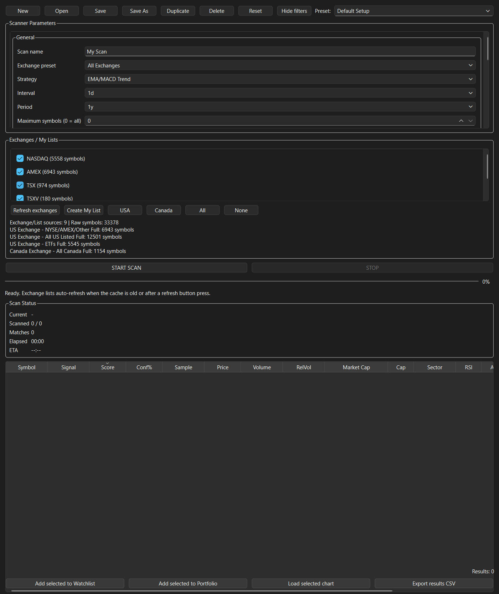
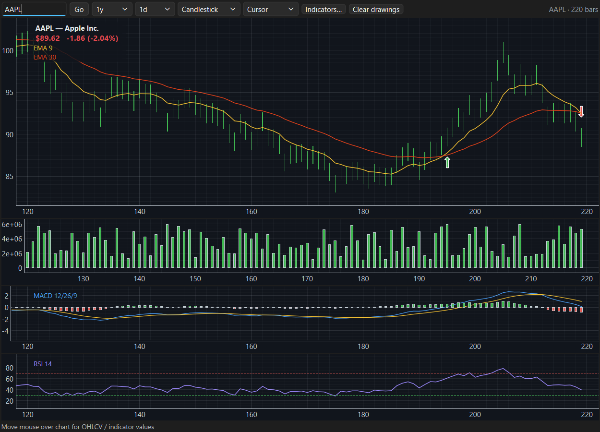
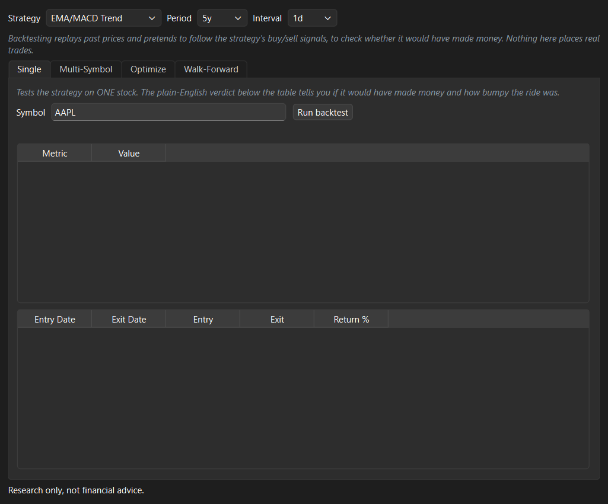
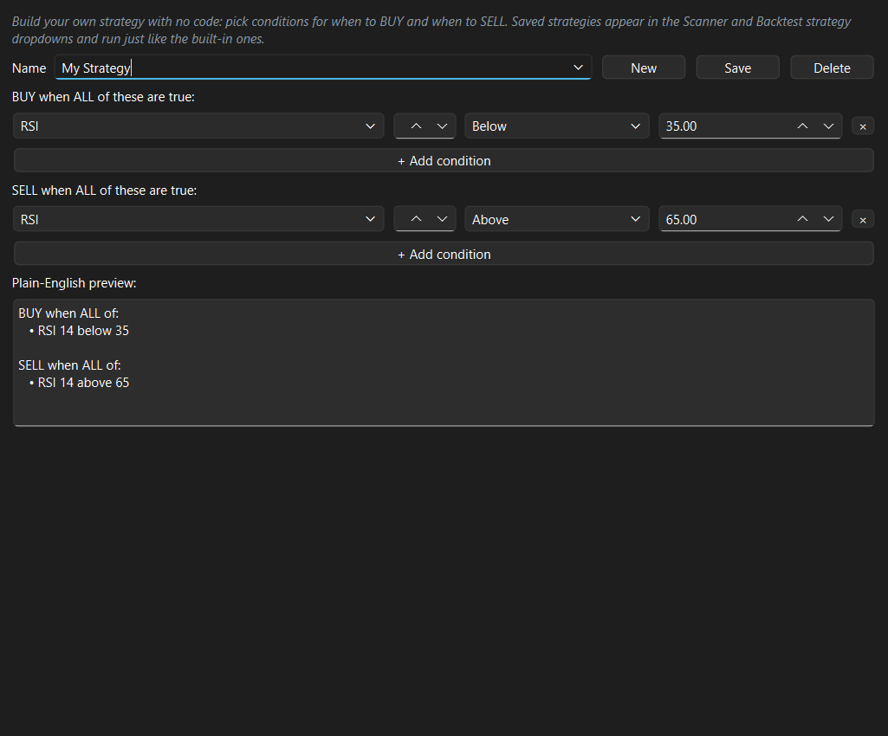
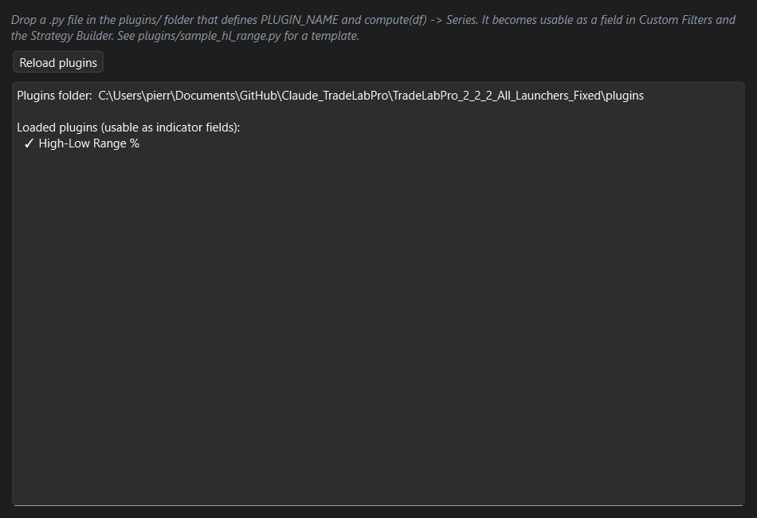
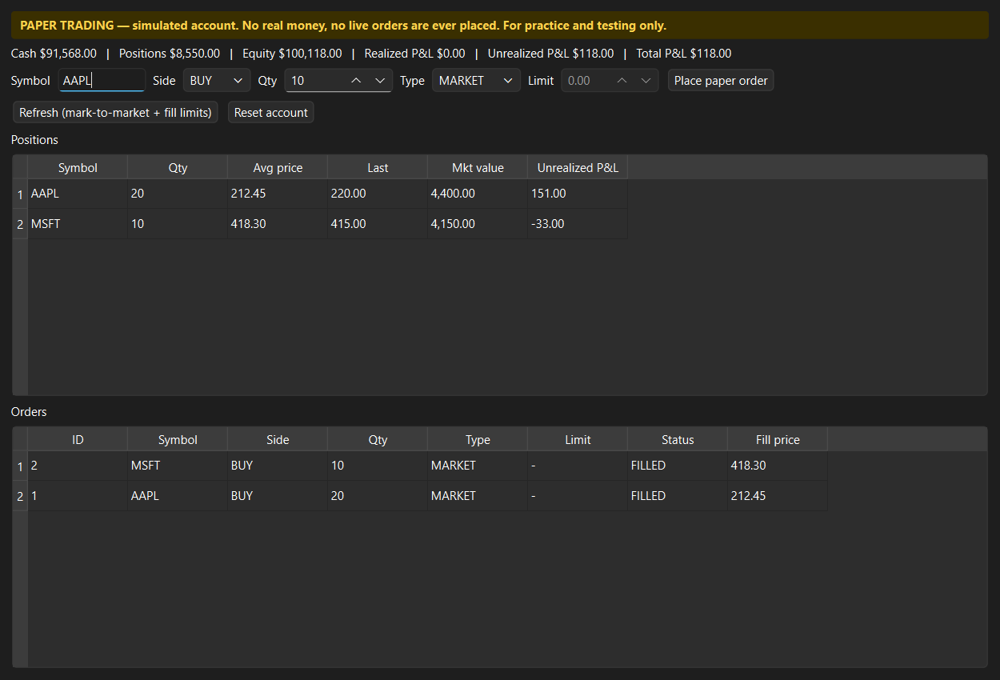
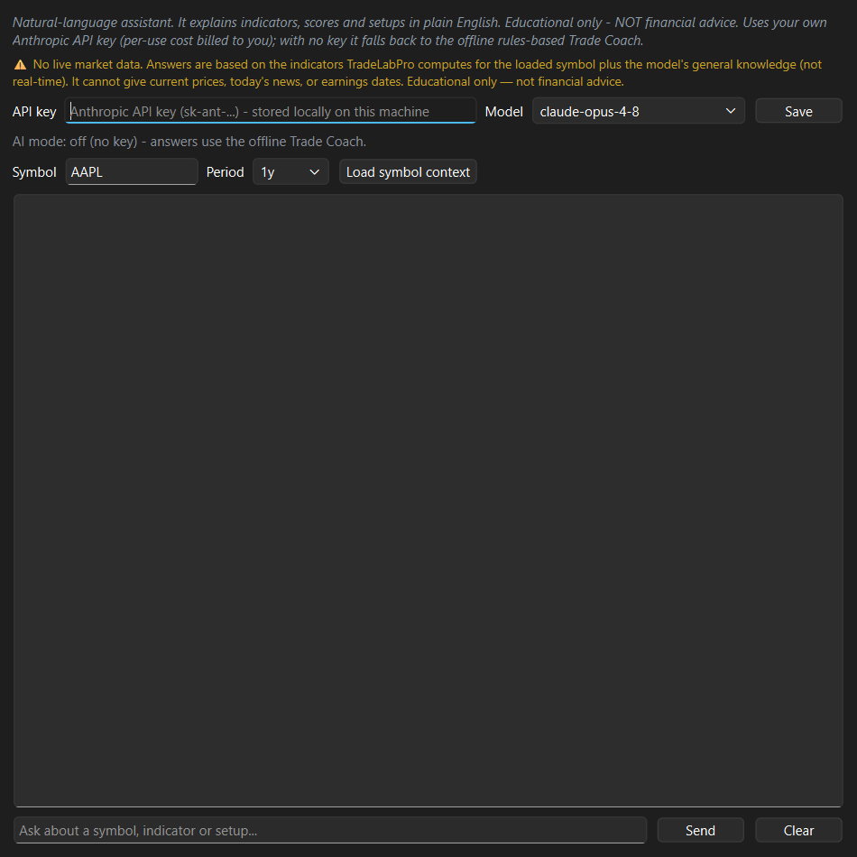

# TradeLab Pro — User Manual

**Version 2.33.0**

TradeLab Pro is a desktop trading **workstation** for the stock market: scan the
market for setups, chart and analyze symbols, keep watchlists and a portfolio,
set price/indicator **alerts**, see a whole market at a glance on a **heatmap**,
backtest strategies, build your own strategies and indicators without code,
**replay** history bar-by-bar, study a symbol's **seasonality**, keep a **trade
journal** (with IBKR import), have an **AI Coach** grade your trades on process
and tell you what to work on, **size positions by risk**, practice with a
simulated paper-trading account, and ask a built-in AI assistant to explain what
you're looking at.

> **Important — what this app is and isn't.** TradeLab Pro is an **analysis and
> practice** tool. It does **not** place real orders, connect to a live
> brokerage for trading, or move real money. Everything about *trading* in this
> app is **simulated**. (It can *read* your own IBKR trade history for the
> journal — that's read-only reporting, never order routing.) Nothing in it is
> financial advice. Always do your own research and consult a licensed
> professional before risking real capital.

---

## Table of Contents

1. [Installation & launching](#1-installation--launching)
2. [The main window](#2-the-main-window)
3. [A five-minute tour](#3-a-five-minute-tour)
4. [Scanner](#4-scanner)
5. [Charts](#5-charts)
6. [Watchlists](#6-watchlists)
7. [Portfolio](#7-portfolio)
8. [Alerts](#8-alerts)
9. [Heatmap](#9-heatmap)
10. [Market dashboard](#10-market-dashboard)
11. [Backtest lab](#11-backtest-lab)
12. [Chart replay](#12-chart-replay)
13. [Seasonality](#13-seasonality)
14. [Strategy builder](#14-strategy-builder)
15. [Plugins](#15-plugins)
16. [Paper trading](#16-paper-trading)
17. [Trade journal](#17-trade-journal)
18. [Coach](#18-coach)
19. [Risk & position sizing](#19-risk--position-sizing)
20. [AI assist](#20-ai-assist)
21. [Settings & your data](#21-settings--your-data)
22. [Tips & FAQ](#22-tips--faq)
23. [Glossary](#23-glossary)

---

## 1. Installation & launching

**Requirements:** Windows, Python 3.11+ (tested through 3.14).

**First-time setup:**
1. Run `install_requirements.bat` to install the Python dependencies.
2. Launch with `run_tradelab.bat` **or** double-click `START_TradeLabPro.vbs`.

The app opens maximized and remembers its window size and position between runs.

**Online vs. offline (data sources).** By default TradeLab Pro pulls market data
from **Yahoo Finance** (`yfinance`) when you're connected. With no internet, it
falls back to **deterministic synthetic data** so every screen stays usable for
practice and demos — the numbers are fake but consistent, so nothing crashes or
blanks out. You can also **choose the data source** in **Settings → Data source**
(e.g. force the offline synthetic source for a demo); see section 21.

---

## 2. The main window

The window is split into two halves:

- **Left — the tabbed control panel.** The tabs are ordered to follow the
  trading process: **Market → Heatmap → News** (market context) → **Scanner →
  Watchlists → Alerts** (find & watch) → **AI Assist → Risk → Paper Trading**
  (analyse, size & act) → **Portfolio → Journal → Coach** (track & review) →
  **Backtest → Strategies → Replay → Seasonality → Plugins** (research/build) →
  **Notes → Links → Settings** (utilities). The tab bar wraps to two rows so
  every tab is visible.
- **Right — the chart workspace.** Always visible. Charts you open from the
  Scanner, Heatmap, Journal, or Replay (or type in directly) appear here as
  dockable panels. A **⛶ Full screen** button expands the chart to the whole
  monitor (Esc to retract).

Drag the divider between the two halves to rebalance the space. Each tab scrolls
internally if it needs more room than the window height, so the bottom of a tab
is always reachable on any screen size.

---

## 3. A five-minute tour

1. **Scan.** Open the **Scanner** tab, pick an exchange/list (e.g. USA), and click
   **Scan**. A ranked table of matching symbols appears.
2. **Map it.** Click **🗺 Map results** to see those symbols as a **Heatmap** —
   sized by market cap, colored green/red by % change, grouped by sector.
3. **Chart.** Double-click a Scanner row (or a heatmap tile) — it loads on the
   chart at right, with the company name and price at the top-left, candlesticks,
   moving averages, and Volume/MACD/RSI sub-panes.
4. **Save / alert.** Add a symbol to a **Watchlist** or **Portfolio**, or open
   **Alerts** and set "RSI below 30" to be notified when it triggers.
5. **Size the trade.** Open **Risk**, enter your account size, risk %, entry and
   stop — it tells you how many shares to trade and your R-multiple targets.
6. **Practice & journal.** Open **Paper Trading**, buy a few simulated shares,
   then **Journal** to review your win rate and expectancy (or import your real
   IBKR history).
7. **Get coached.** Open the **Coach** tab for a letter grade on how well you
   *executed* each journaled trade — and a short list of process habits to work
   on.
8. **Ask.** Open **AI Assist**, load a symbol's context, and ask "what is this
   setup telling me?" in plain English.

---

## 4. Scanner

The Scanner filters the market down to symbols matching your criteria and ranks
them by a 0–100 **Score**.



### Running a scan
1. Choose which symbols to scan using the **exchange / list** selectors
   (shortcuts: USA, Canada, All, None; your own lists live under **My Lists**;
   ETFs are under My Lists, not Exchanges).
2. Set your filters (below).
3. Click **Scan**. Use **Stop** to interrupt a long scan.

### Filters
- **Price / Volume / Market cap** — minimum and maximum bounds.
- **Relative volume, RSI range, ATR% range** — momentum and volatility gates.
- **EMA trend / positive MACD** — require a trend condition.
- **Custom filters** — add your own conditions across 16+ technical fields
  (price, volume, RSI, ATR%, ADX, MACD family, EMAs, SMAs, Bollinger bands,
  price-vs-SMA20%, and any indicator plugins you've added). Each is
  Above / Below / Between a value, and all are AND-ed with the fixed filters.
- **Strategy** — the dropdown chooses which strategy scores and signals each
  symbol (e.g. EMA/MACD Trend, RSI Mean-Reversion, or any custom strategy you
  built). This drives the Signal and Score columns.

### Reading the results
Columns: **Symbol, Signal, Score, Conf%, Sample, Price, Volume, RelVol,
Market Cap, Cap, Sector, RSI, ATR%, EMA, MACD**.

- **Score (0–100)** — the strategy's overall read; rows are color-tiered by score.
- **Signal** — BUY / SELL / neutral per the selected strategy.
- **Conf% / Sample** — of the strategy's past BUY signals on this symbol, the
  fraction that were profitable 10 bars later, and how many signals that's based
  on. A high Conf% on a large Sample is more trustworthy than one on a tiny
  sample. A dash (—) means not enough history.
- **Cap** — Mega / Large / Mid / Small / Micro bucket.
- Error rows (Score 0) render in gray, with the error message on the Symbol
  cell's tooltip — so a scan failure never masquerades as a weak result.

Double-click a row to chart it. The buttons below add selected rows to a
Watchlist/Portfolio, load a chart, export the results, or **🗺 Map results** —
which sends the scan results to the **Heatmap** tab as a custom map (section 9).
The status line summarizes counts and a sector breakdown.

### Presets
Use the **Preset** combo to save, switch, and delete named scan setups (stored in
`data/setups/`). "Save As" creates a new one; the list stays in sync
automatically. **Open** loads a setup file from elsewhere on disk. You can also
**export** scan results.

---

## 5. Charts

The chart workspace on the right renders responsive, zoomable charts (built on
PyQtGraph).



### Loading & navigating
- Load a symbol by double-clicking a Scanner result, clicking a heatmap tile, or
  typing a ticker into the chart's own search box.
- **Period** and **Interval** selectors set the history length and bar size.
- **Pan** by dragging, **zoom** with the scroll wheel, and read exact values from
  the **crosshair** — a synced readout across the price, Volume, MACD, and RSI
  panes shows date/time and full OHLCV plus indicator values in the bottom status
  bar.

### The price header
Top-left of the price pane shows:
```
AAPL — Apple Inc.
$212.45   +1.32 (+0.63%)
```
The company name, then the **latest price** and its **day-over-day change**
(green when up, red when down). This is the last close of the loaded history, not
a live streaming tick.

### Chart types
**Candlestick, Heikin-Ashi, Line, Area.**

### Indicators
Click any entry in the on-chart **legend** (top-left) to open the **Indicators**
dialog — the legend *is* the editing entry point. From there you can:
- Add / remove **overlays** with tunable periods: EMA, SMA, Bollinger, VWAP,
  Pivot Points, SuperTrend, Ichimoku Cloud, Volume Profile, and any plugin
  indicators.
- Toggle the **Volume / MACD / RSI** sub-panes and tune their periods. A
  "Show all sub-panes" button restores any you turned off by accident.
- Toggle **BUY/SELL signal** markers (EMA-crossover confirmed by MACD).

### Drawing tools
Trendline, horizontal line, vertical line, rectangle, **Fibonacci retracement**,
and text notes. Drawings are **saved per symbol and timeframe**, so they're still
there when you come back.

### Multiple charts & layouts
Open several charts side by side as dockable panels; a switcher row (below the
toolbar) has one button per open chart, plus a small close (×) on each and a
**Reset charts** button to collapse back to one. You can save and reload named
chart **layouts**.

---

## 6. Watchlists

Track symbols you care about. The table shows **Item, Symbol, Last, Change %,
Purpose**. You can import and export watchlists. Add symbols directly from Scanner
results, or by right-clicking a **Heatmap** tile → *Add to watchlist*. Selecting
an entry can load it on the chart.

---

## 7. Portfolio

A simple holdings record: **ID, Portfolio, Symbol, Shares, Entry**. Add positions
(e.g. from a Scanner result), group them by portfolio name, and export. This is a
**record-keeping** ledger for positions you hold elsewhere — it does not place or
track live orders. Your portfolio also feeds the **Heatmap** (Portfolio map) and
the **Risk** tab's sector-exposure view. For simulated order entry and P&L, use
**Paper Trading** (section 16).

---

## 8. Alerts

Get notified when a symbol meets a condition — without watching the screen.

**How it works.** Pick a symbol and build a condition using the same builder as
the Scanner (price, RSI, MACD, EMA/SMA crossovers, VWAP, and every other
indicator, including plugins). A background poller checks it on a timer and, when
it triggers, pops a **desktop notification**, logs it in the tab, and updates the
alert's status.

**Edge-triggered.** An alert fires once when the condition *crosses* from false to
true (e.g. "RSI Below 30" fires as RSI drops through 30), not repeatedly while it
stays true. Two modes:
- **Recurring** — re-arms once the condition releases, so it can fire again on the
  next crossing.
- **Once** — fires a single time, then turns itself off.

**Controls.** Add an alert (optionally pick a symbol from your watchlist),
enable/disable or remove selected ones, **Check now** for an immediate pass, and
turn on **Auto-check** with an interval (15 s – 1 h). Triggered alerts appear in
the in-panel log. Alerts persist between runs (`data/alerts.json`).

> Alerts are an analysis aid only — they never place orders.

---

## 9. Heatmap

A whole market at a glance, Finviz-style: every stock/ETF is a **tile sized by
market cap** (or dollar volume) and **colored green→red by its % change**, grouped
into sector blocks.

**Pick what to map (Market dropdown):**
- **US / Canada presets** — Mega/Large caps, NASDAQ, NYSE, TSX (and expanded TSX).
- **ETF / index maps** — US Sector ETFs (SPDRs), Index & asset ETFs, all US ETFs,
  Canada ETFs. Funds are sized by **AUM** and grouped by fund **category**.
- **World – Large caps** — major global companies (ADRs), auto-grouped by country.
- **Watchlist** and **Portfolio** — map your own lists.
- **Scanner results** — appears automatically when you use **🗺 Map results** on
  the Scanner.

**Theme baskets.** The **Theme** dropdown maps a curated basket — AI, Semiconductors,
EV & Battery, Cloud & SaaS, Cybersecurity, Biotech, Renewable Energy, Fintech,
E-commerce, Defense & Aerospace, Gaming, Social Media. A theme overrides the
Market while selected.

**Period.** The **Period** dropdown sets the window the color represents:
1 Day / 1 Week / 1 Month / 3 Month / 6 Month / 1 Year / 3 Year / 5 Year / 10 Year
/ YTD. Change it and the map re-colors.

**Group by.** Sector, Industry, Country, or None.

**Reading & navigating.**
- **Left-click** a tile to chart it; **right-click** for *Open chart* / *Add to
  watchlist*. Hover for a tooltip (name, sector, industry, country, price, %
  change, size).
- **Scroll to zoom** in on dense maps — tiles grow while labels stay a readable
  size, and tickers that were too small to show simply appear. **Drag to pan**,
  **double-click** empty space to fit again.
- **Auto-refresh** reloads the map on a timer (15 s – 1 h) so it tracks the day.
- **Size by** (market cap / dollar volume) and **Max** (tile cap) tune the view.

---

## 10. Market dashboard

A one-glance read on overall conditions:
- A color-coded **macro headline** with a 0–100 "is it a good day to trade" read
  and the reasons behind it.
- A **sector-breadth table** across 11 SPDR sector ETFs: **Sector, ETF, Change %,
  vs 50-day**, plus a breadth summary line (how many sectors are above/below
  their moving averages).
- A regime-symbol table that feeds the read.

Use this before scanning to gauge whether the broad market is with you or against
you.

---

## 11. Backtest lab

Test a strategy against historical data.



Four sub-tabs:

- **Single** — run one strategy on one symbol; see metrics (win rate, total
  return, profit factor, **max drawdown %**) and the full trade list (Entry Date,
  Exit Date, Entry, Exit, Return %).
- **Multi-Symbol** — the same strategy across many symbols, aggregated:
  Symbol, Trades, Win rate %, Total return %, Profit factor, Max drawdown %.
- **Optimize** — sweep a single parameter to see which value performed best.
- **Walk-Forward** — test across rolling time windows (Window, From, To, Trades,
  Win rate %, Total return %) with a consistency score, to check a strategy isn't
  just curve-fit to one period.

Each tab includes plain-language hints and color-coded verdicts that interpret
the numbers for you.

> **Backtests describe the past, not the future.** Good historical numbers are
> necessary but not sufficient. Watch the sample size, the max drawdown, and
> whether results hold up across walk-forward windows.

---

## 12. Chart replay

Practice reading a chart with the future hidden — a bar-by-bar "replay" of history.

1. Enter a **Symbol** and **Period**, choose **Start at bar N** (how many bars to
   reveal first), and click **Load replay**.
2. Use the transport controls: **▶ Play / ⏸ Pause**, step **◀ / ▶** one bar,
   **⏮** back to the start, **⏭** reveal everything, and a **Speed** control
   (0.5× – 8×).
3. **Scrub** anywhere with the slider.

Because only the revealed bars are shown, indicators recompute on those bars
alone — there's genuinely **no look-ahead**, so it behaves exactly as the chart
would have live. It plots into your main chart workspace, so overlays, sub-panes,
and drawings all work.

---

## 13. Seasonality

See how a stock has historically behaved by the **calendar** — whether the month
you're in has tended to be kind or cruel to that name.

**How to use it.** Enter a **Symbol**, pick how much **History** to analyze
(2y / 5y / 10y / max), and click **Analyze**. The data is fetched in the
background (the window stays responsive), then three tables and a plain-English
headline fill in.

**The headline** answers the question directly, for example:
```
SPY — Over 10 years of history, July has been historically strong:
it averaged +1.8% with a 70% win rate (10 occurrences).
```
It also names the historically strongest and weakest months overall.

**By month** *(the centerpiece)* — one row per calendar month with:
- **Avg %** — the average month-over-month return for that month across every
  year in the sample. This column is a **green→red heatmap**, so strong and weak
  months jump out at a glance.
- **Win %** — how often that month closed higher.
- **Best % / Worst %** — the best and worst single occurrences.
- **Years** — how many years of that month are in the sample (more = more
  trustworthy).

The historically strongest and weakest months are shown in **bold**.

**By weekday** — the same average-return and win-rate read for Monday through
Friday (day-of-week seasonality).

**By year** — a year-by-year performance table (each year's return from its first
to its last close), most recent first.

> **Descriptive, not predictive.** Seasonality summarizes what price *did* in
> past calendars — it does **not** forecast the next one. A "strong July" is a
> historical tendency, not a promise, and small samples (few years) are weak
> evidence. It's a context tool, not a signal, and it's not financial advice.

---

## 14. Strategy builder

Build your own BUY/SELL strategies **without code**:



1. Add **condition blocks** for entry (BUY) and exit (SELL) — e.g. "RSI Below 30",
   "EMA 9 Above EMA 21", "Price Above SMA 200".
2. Conditions support **field-vs-value** and **field-vs-field** comparisons (for
   crossover-style rules).
3. **Save** the strategy — it's stored in `data/strategies/` and immediately
   appears in the Scanner and Backtest **Strategy** dropdowns, running exactly
   like the built-in strategies.

The available fields include the full indicator library (Stochastic, Williams %R,
CCI, ROC, OBV, MFI, VWAP, and more), each period-parameterized with sensible
defaults.

---

## 15. Plugins

Extend TradeLab Pro with **custom indicators** written in Python:



- Drop a `.py` file in the `plugins/` folder that defines `PLUGIN_NAME` and a
  `compute(df)` function returning an indicator series.
- It's auto-discovered at startup (and via the **Reload** button on this tab) and
  registered as an indicator field (`plugin:<name>`) usable in Scanner custom
  filters, the Strategy Builder, and chart overlays.
- The Plugins tab lists every plugin as loaded-OK or errored (errors are shown,
  never fatal). A bundled `sample_hl_range.py` is included as a template.

> **Plugins vs. data sources.** A *plugin* is a local custom **indicator** — it
> never connects to anything. Choosing where prices come from is a separate
> **data source** setting (section 21).

---

## 16. Paper trading

A fully **simulated brokerage account** for practice — the safe way to rehearse
order entry and watch P&L behave.

> **Simulated only.** No real money moves and no live orders are ever placed.
> Everything fills against a local ledger inside the app. A prominent amber banner
> on the tab is your reminder.



**Starting out:** the account begins with **$100,000** in simulated cash. It
persists between runs (in `data/paper_account.json`).

**Placing an order:**
1. Enter a **Symbol**, choose **BUY** or **SELL**, set the **Qty**, and pick
   **MARKET** or **LIMIT**.
2. **Market** orders fill immediately at the latest price. **Limit** orders rest
   until the price crosses your limit — click **Refresh** to fill any that have.
3. The order appears in the **Orders** table (with status and fill price).

**Watching your account:** the summary line shows **Cash, Positions value,
Equity, Realized P&L, Unrealized P&L, Total P&L**. The **Positions** table marks
each holding to market (Symbol, Qty, Avg price, Last, Market value, Unrealized
P&L). Both long and short positions are supported with proper average-cost and
realized-P&L accounting.

**Refresh** re-marks positions to the current price and fills any crossed limit
orders. **Reset account** wipes everything back to the starting cash (with a
confirmation). You can pull your paper fills straight into the **Trade Journal**
(section 17).

---

## 17. Trade journal

Log your trades, tag them, and review what actually works.

**Log a trade.** Enter symbol, side (Long/Short), quantity, entry, an optional
**stop**, a strategy name, tags, and notes. Each trade shows **P&L, P&L %,
R-multiple** (result in units of the risk you set with your stop), holding **Days**,
entry/exit dates, and status.

**Review the numbers.** A live stats line shows **win rate, W/L, expectancy per
trade, profit factor, average R,** and **total P&L**. A **breakdown** table groups
your trades by **Strategy / Tag / Symbol** so you can see which setups make money.
Click any column header to sort (numbers sort by value, not text).

**Import instead of retyping:**
- **From Paper Trading** — pairs your paper account's fills into round-trip trades.
- **From IBKR (CSV)** — load an Interactive Brokers trades export (Flex Query or
  Activity Statement).
- **From IBKR (Flex Web Service)** — a direct pull: paste your read-only **Flex
  token + Query ID** (stored locally; **Save** keeps them for next time, and they
  survive app updates) and the app fetches your report over HTTPS.
  - To set that up in IBKR: **Performance & Reports → Flex Queries** → create a
    **Trades** query that includes the **Trade Price** field (required), then
    enable the **Flex Web Service** to get a token. Big accounts take a moment to
    generate — if it says "still generating," wait a few seconds and fetch again.

All imports pair fills into position-level round-trips and **de-duplicate**, so
re-importing the same data won't create duplicates. You can **Close** open trades,
**edit notes**, **export to CSV**, and double-click a row to chart the symbol.

> **Read-only.** IBKR import only *reads* your own trade history — it never logs
> in to trade, routes orders, or moves funds. The journal is stored in
> `data/journal.json`.

---

## 18. Coach

Your **AI Trading Coach** reviews the trades in your **Journal** and grades how
well each one was *executed* — not just whether it made money. The whole tab is
**retrospective**: it reviews what you already did and gives you process
feedback. It never tells you what to trade next, and it never predicts a price.

> **Process, not outcome.** A trade can be profitable and still be graded poorly,
> and a losing trade can be graded well. A lucky win taken with **no stop** (so
> your risk was undefined) grades badly; a small, disciplined **−1R** loss taken
> *with* a stop and a written plan grades well. The Coach rewards good habits,
> because good habits are what pay off over many trades.

**How a trade is graded (A–F).** Everything starts at a neutral score and each
process check moves it up or down, with the reason recorded:
- **Did you define your risk with a protective stop?** This is the cornerstone —
  trading with an undefined risk is penalized the most heavily, so a no-stop
  trade can't grade well no matter how it turned out.
- **Was the stop honored?** On a losing trade, did the loss stay within the ~1R
  you planned, or did it run well past it (stop widened, ignored, or gapped
  through)?
- **Reward vs. risk (R-multiple).** What you actually captured relative to what
  you risked — a +2R win scores better than a scrappy sub-1R one.
- **Did you write down a plan?** A trade with a strategy or notes can be reviewed
  later; one with neither can't.

**Reading the tab:**
- **Overall process grade** — a single A–F (and a 0–100 score) across all your
  closed trades, color-coded.
- **Graded trades table** — every closed trade with its grade, R-multiple, and
  P&L. **Click any row** to see its full point-by-point breakdown in the chat log
  below (what added or subtracted, and why).
- **Process review** — the plain-text report on the right: your win rate,
  expectancy, profit factor, the share of trades with **no stop**, how often
  stops were **honored**, whether you **hold losers longer than winners**, how
  documented your trades are, and a short list of concrete **"what to work on"**
  suggestions — each citing the number behind it.

**Optional AI chat.** Ask the coach questions in plain English —
*"What's my biggest weakness?"*, *"How's my stop discipline?"* — and it reasons
over your compiled grades and stats. This uses the **same Anthropic API key as
the AI Assist tab** (enter it once, in either tab); with no key you still get the
full offline review, and the chat simply shows that report instead.

> **Works fully offline.** Every grade, the process report, and all the
> suggestions are computed **locally** on your PC with plain math — no API key and
> no internet required. The AI chat only *narrates* those numbers; it never
> invents trades or figures. Educational process feedback only — not financial
> advice.

The Coach reads the same journal you see in the **Journal** tab and refreshes
automatically whenever you open it (there's also a **Refresh from journal**
button). Log or import some trades first (section 17), then check the Coach.

---

## 19. Risk & position sizing

Size trades by risk instead of by gut, and see how concentrated your book is.

**Position sizing.** Enter your **account equity**, the **% you'll risk** (or a
fixed dollar amount), the **side**, your **entry**, and your **stop**. The tab
instantly shows the **share count** that risks exactly that amount, plus the
position value and % of account, the actual dollars/%-at-risk, the stop distance,
and the dollars-per-share risked. An optional **max position %** caps the size
(and flags when the cap kicks in). "Use paper account equity" fills equity from
your paper account.

**R-multiple targets.** A table of **1R / 2R / 3R** target prices and the dollar
gain for the sized position — where **1R** is your stop distance (longs aim up,
shorts down).

**Portfolio sector exposure.** Load your Portfolio-tab positions to see them
broken down by sector with % of book, flagging heavy concentration (≥ 40 % in one
sector).

> This is a **planning** tool — it never places orders.

---

## 20. AI assist

A natural-language assistant that **explains** indicators, scores, and setups in
plain English.



> ⚠ **No live market data.** It reasons over the indicator snapshot TradeLab Pro
> computes for the loaded symbol plus the model's general knowledge — not
> real-time prices, today's news, or earnings dates. **Educational only — not
> financial advice.** By design it won't tell you to buy, sell, or hold.

**Two modes:**
- **Offline Trade Coach (default, free).** With no API key set, you get a
  rules-based explainer at zero cost — always available.
- **LLM-backed (bring your own key).** Paste an **Anthropic API key** and pick a
  model to get richer, conversational answers. Per-use cost is billed to *your*
  Anthropic account.

**Setting up the LLM mode:**
1. Create a key at **console.anthropic.com** → API Keys, and add a little billing
   credit (the key won't work without it).
2. Paste it into the **API key** field and choose a **model**:
   - **Sonnet 5** *(default)* — the best balance; near-Opus quality for
     technical-analysis explanations at a fraction of the cost (~½–1¢ per
     question).
   - **Haiku 4.5** — cheapest (~⅓¢), great for simple "what is X?" lookups.
   - **Opus 4.8** — the richest multi-indicator reasoning (~1.3¢), when you want
     the most careful answer.
3. Click **Save**. The key is stored on your PC (Windows registry, under
   `TradeLabPro`) — treat it like a password; on a shared machine prefer an
   `ANTHROPIC_API_KEY` environment variable, or clear the field when done.

**Using it:** load a symbol's context, then ask questions like "Is this an uptrend
and why?" or "What does the RSI reading here mean?" Follow-ups in the same chat
cost a bit more (the whole conversation is re-sent each turn); use **Clear** to
reset. It's great at *"what does this setup mean"* and useless for *"what's the
price right now"* — that's the data limitation, not the model.

---

## 21. Settings & your data

The **Settings** tab lets you choose your **Data source** and shows where your
data lives (database path, data folder, scan-history counts).

**Data source.** A dropdown selects where prices and fundamentals come from:
- **Yahoo Finance** *(default)* — live data via `yfinance`, with the synthetic
  fallback when a symbol or feed fails.
- **Offline (synthetic)** — deterministic generated data, **no network** at all;
  handy for demos, testing, or when a feed is down.

Your choice is remembered between launches and applied before any tab fetches
data. Switching source clears the in-process quote cache so new lookups come from
the new source. (The app is built so more sources — e.g. Alpaca, Polygon, an IBKR
feed — can be added later without changing any other tab.)

**Where things are stored** (all under the app's `data/` folder unless noted):
- `data/tradelab.db` — the SQLite database (watchlists, portfolio, scan history).
- `data/setups/` — saved Scanner presets.
- `data/strategies/` — your custom strategies.
- `data/paper_account.json` — your simulated paper-trading account.
- `data/alerts.json` — your saved alerts.
- `data/journal.json` — your trade journal.
- `logs/` — rotating application logs (useful if something misbehaves).
- Your **API key**, **IBKR Flex token/query id**, chosen **data source**, and
  window layout — in the Windows registry under `TradeLabPro`, not in a file.

The database uses versioned migrations, so it upgrades cleanly across releases.

---

## 22. Tips & FAQ

**Where is my API key / IBKR token stored?** In the Windows registry under
`HKEY_CURRENT_USER\Software\TradeLabPro\TradeLabPro` (the API key can instead come
from an `ANTHROPIC_API_KEY` environment variable). These are plain text — guard
them like passwords. They persist across app updates.

**Why does the AI say it can't give me the current price?** Because it has no live
market feed — it only sees the indicator snapshot the app computes plus its
training knowledge. That's a deliberate limitation, not a bug.

**Can this place real trades?** No. Order entry exists only in **Paper Trading**
and is entirely simulated. The IBKR connection is **read-only** (it imports your
past trades into the Journal); it never routes orders.

**My IBKR import said "no trades" / dropped some.** Make sure your Flex Query
includes the **Trade Price** field (the app names any missing field), that its
date period covers your trades, and that it's an **Activity** Flex Query. Options
and futures import too (their contract multiplier is applied so P&L is in real
dollars). A large report may still be generating — wait a few seconds and fetch
again.

**A scan row is gray — what happened?** That's a scan error for that symbol (data
fetch failed, etc.), shown distinctly from genuinely weak results. Hover the
Symbol cell for the error message.

**Why did the Coach give my winning trade a bad grade?** Because it grades your
*process*, not the outcome. The most common reason is **no protective stop** — if
your risk was undefined, the trade grades poorly even if it happened to profit.
Click the trade's row in the Coach to see exactly what added and subtracted.

**Do I need an API key for the Coach?** No. All the grading, the process report,
and the suggestions run offline with no key or internet. A key only unlocks the
optional **AI chat** (shared with the AI Assist tab, section 20).

**Nothing loads / I'm offline.** The app falls back to deterministic synthetic
data so screens stay usable. Reconnect for real Yahoo Finance data, or set
**Settings → Data source** deliberately.

**The heatmap tickers are too small.** Scroll to **zoom** in (labels appear as
tiles grow), drag to pan, and double-click empty space to fit. You can also lower
**Max** or switch **Size by → Dollar volume** to enlarge tiles.

**My chart drawings disappeared.** Drawings are saved per symbol *and* timeframe —
switch back to the same interval to see them.

---

## 23. Glossary

- **EMA / SMA** — Exponential / Simple Moving Average.
- **MACD** — Moving Average Convergence Divergence (trend/momentum).
- **RSI** — Relative Strength Index (0–100 momentum oscillator; >70 often
  "overbought", <30 "oversold").
- **ATR%** — Average True Range as a percent of price (volatility).
- **Relative volume (RelVol)** — today's volume vs. its typical level.
- **Bollinger Bands** — a moving average with volatility bands above and below.
- **VWAP** — Volume-Weighted Average Price.
- **Score** — TradeLab Pro's 0–100 ranking of a setup for the selected strategy.
- **Conf%** — the historical hit-rate of the selected strategy's past BUY signals
  on that symbol.
- **Seasonality** — a stock's recurring calendar tendencies: how it has performed
  on average by month, weekday, and year over its history. Descriptive of the
  past, not a prediction.
- **Max drawdown** — the largest peak-to-trough drop in a backtest's equity.
- **Profit factor** — gross profit ÷ gross loss (>1 is profitable).
- **Expectancy** — average profit/loss per trade over your journal's closed trades.
- **R-multiple / 1R** — trade result measured in units of the risk you took; 1R is
  your entry-to-stop distance, so +2R means you made twice what you risked.
- **Process grade (Coach)** — an A–F score of how well a trade was *executed*
  (risk defined with a stop, stop honored, reward-to-risk, documented plan),
  independent of whether it happened to be profitable.
- **AUM** — Assets Under Management, used to size ETF/fund tiles on the heatmap.
- **Edge-triggered (alerts)** — fires once as a condition crosses from false to
  true, not repeatedly while it stays true.
- **Flex Query / Flex Web Service** — IBKR's read-only reporting export used to
  import your trade history into the Journal.
- **Data source / provider** — where the app fetches prices & fundamentals
  (Yahoo Finance or the offline synthetic source).
- **Paper trading** — simulated trading with fake money, for practice.
- **Realized / Unrealized P&L** — profit/loss on closed positions / on open
  positions at the current price.
- **Long / Short** — a position that profits when price rises / falls.

---

*TradeLab Pro is an educational analysis and practice tool. It is not a brokerage,
does not execute trades, and does not provide financial advice.*
